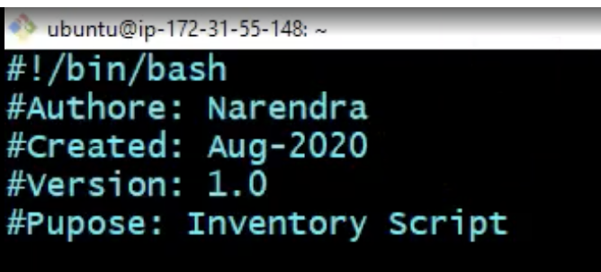
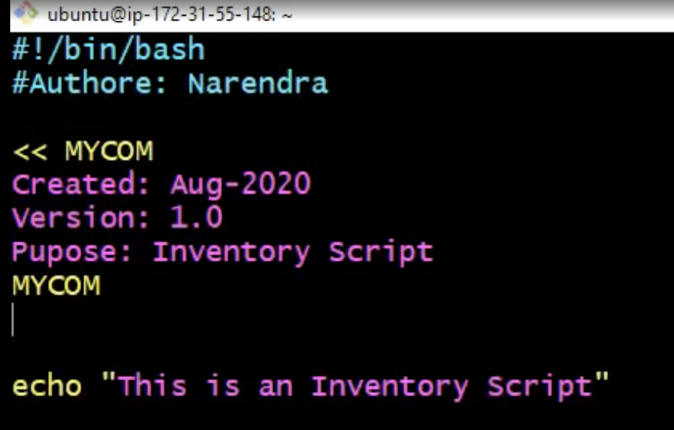
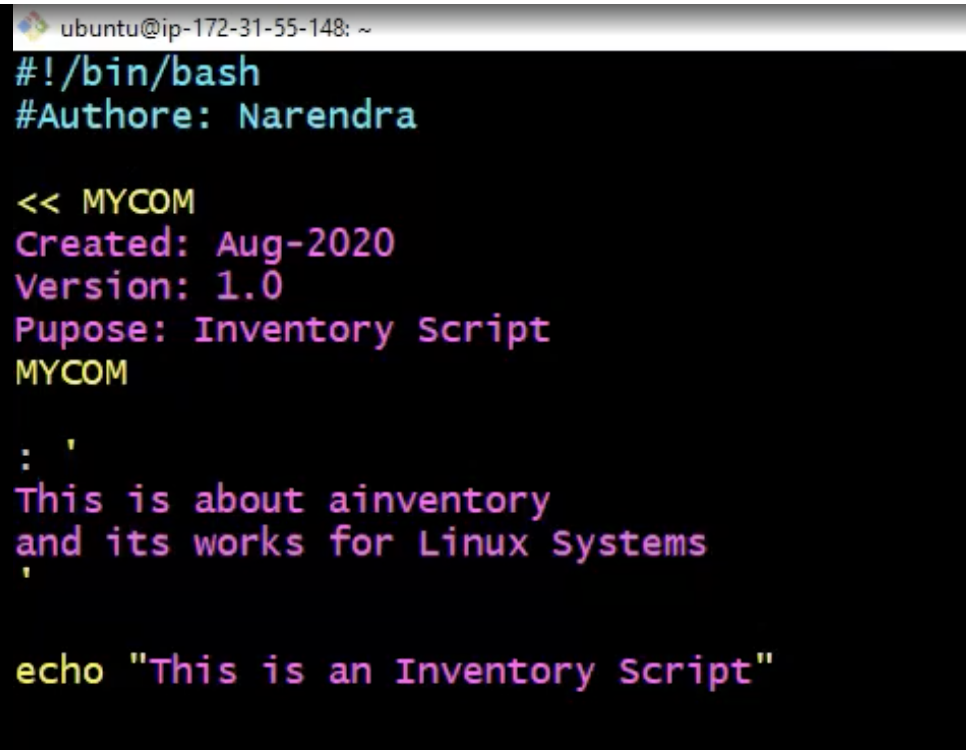

# Comments for Bash Shell Scripting
- Comment is human readable explanation what is written in the shell script
- Why we need to comment? 
    1. Adding comments to your Bash script will save you a lot of time and effort when you look at your code in the future
    2. Comments are used to explain the code
    3. The comments also help other developers and system admins who may need to maintain the script to understand your code and it purpose

- Here, we have two type of comments. They are:
    1. Single line comments
    2. Multi-line comments

    NOTE: Comments wont execute while running or executing your script
      

    ### Comment Multiple Lines
    - You can use here doc delimeter to comment multiple lines
      
    - Or you can comment it with `: '  ' ` symbols
      