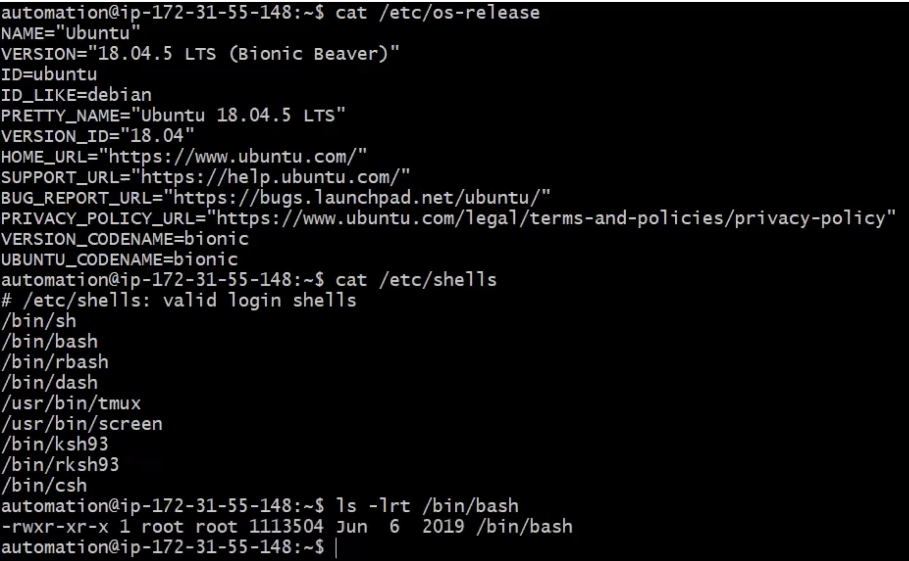
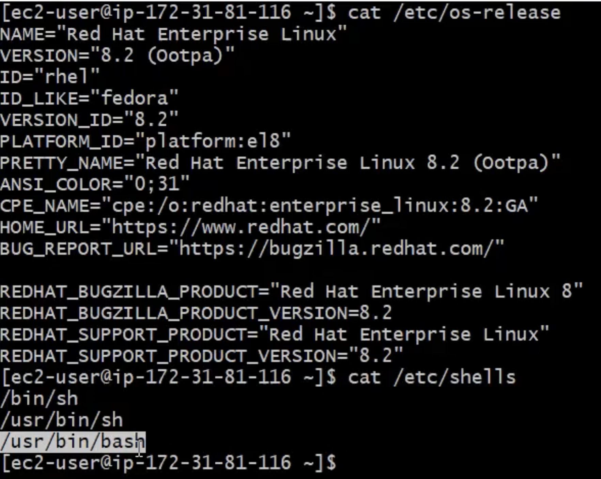

# Make Bash Shell Scripting as Portable with Unix/Linux Systems
- What is Shebang line? 
    - Shebang line means: Which shell we are using to execute our shell scripts
- In our case we are implementing bash shell and we are using shebang #!/bin/bash

- You can check your OS release version by running the following command. This is Ubuntu server
 <br> 

- But if you check Rhel OS bash location is in different place
 <br> 

- How can you make your bash script working in Both Linux and Uninx like systems?
```
- Ubuntu ====> path is under /bin/bash
- Rhel   ====> path is under /usr/bin/bash
```
- If you run `which env` command, it will give you location for env 
```
/usr/bin/env   ===> rhel
/usr/bin/env ====> Ubuntu
Path are same
```

### So, we can make our bash shell scripts as portable using:

 <br> 