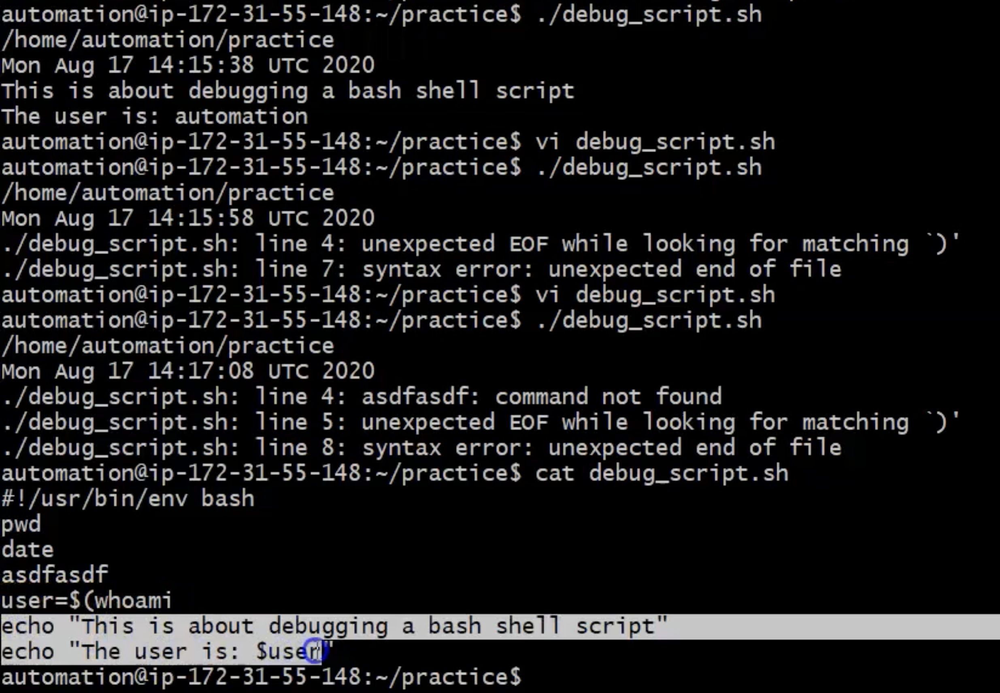
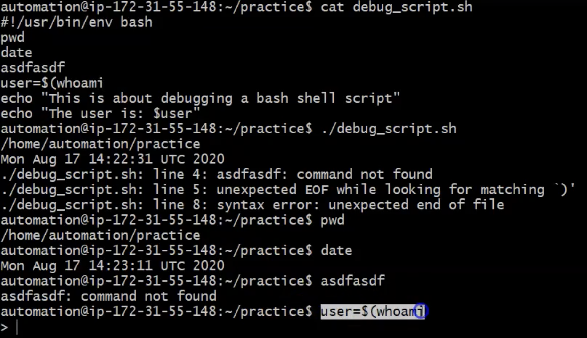
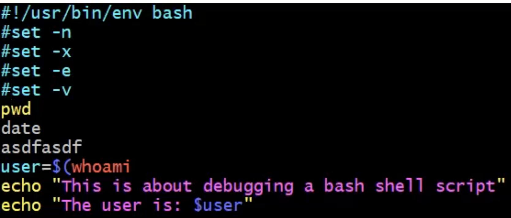
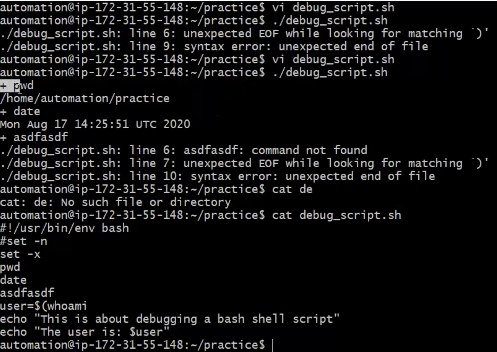
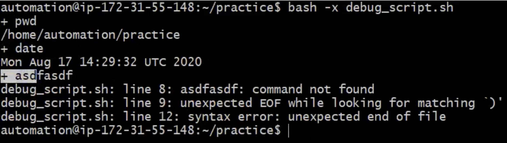
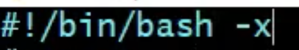
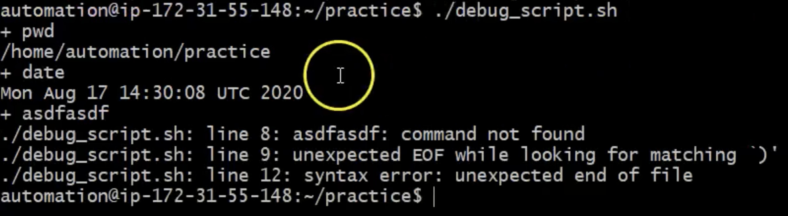

# Debugging Shell Scripts
- What does debugging means? It is determining the cause which fails the script. In as simple workd finding the cause which is making script fails is debugging
- Why scripts fails?
    Becuse of errors
- There are two common types of errors in shell script
    1. Syntax Errors
    2. Runtime Errors

### What is Syntax Errors and Runtime Errors? 
```
Lets say we have script:
#!/usr/bin/env bash
 
ddkfld   ====> Command not found  =====> Runtime Error example
time=$(date   ====> unexpected EOF while looking for matching ')'   ===> Syntax error example
```
 <br> 

NOTE: Syntax Errors stops script execution and run time errors do not stop scripts
- Bash is interpreter ===> means it is program enterpreter while there is compiler
- What is the differenve between compiler and interpreter? 
    1. Interpreter: Interpreter will read your code line by line and will execute your code line by line
    2. Compiler: will read your entire code at a time, it will check all your syntax errors and make a list of them before executing it
- Small hint is you can check your code line by line and execute exactly the same line and check if an erros is there like in the description below 
 <br> 

## Debugging with `sed` command
- Actually we do not have good debugging procedures wich shell scripting, but we can try with some command and one of them is `set` command

- What is `sed` command and it is options
    Syntax
    ```
    set [options]
    No options: To list system defined variables
    set -n =====> No Execution, Purely Syntax check
    set -x =====> Command line check
    set -e =====> Stop running script when any command fails
    set -v =====> Verbose 
    ```
- In the example below as we can see we have our script:
 <br> 
- This is an output to the script
 <br> 

- Another important point is: You can directly give an option while executing your script
 <br> 

- Or you can define this right in the Shebang part on the top of the script is the same as you execute it in the command line
 <br> 
 <br> 