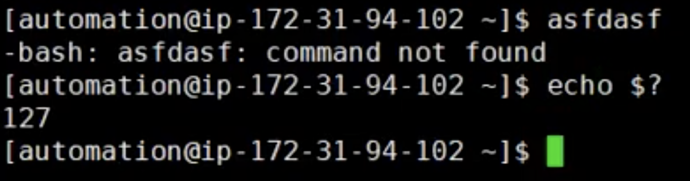
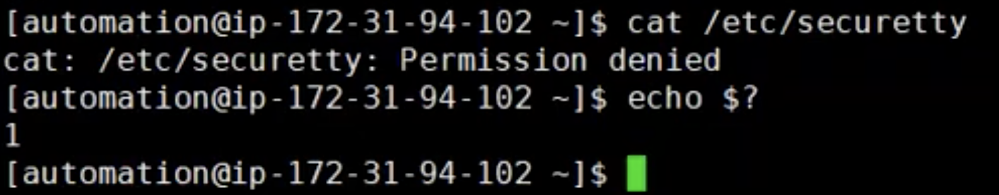
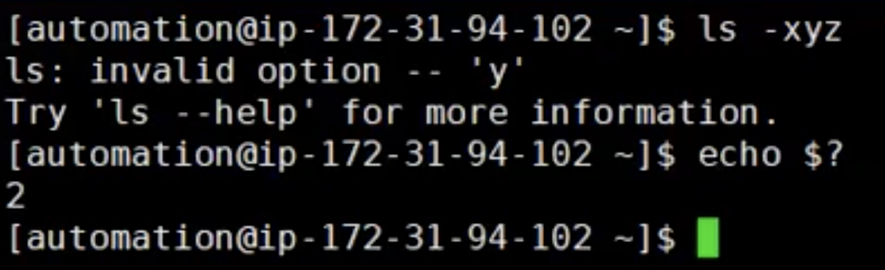
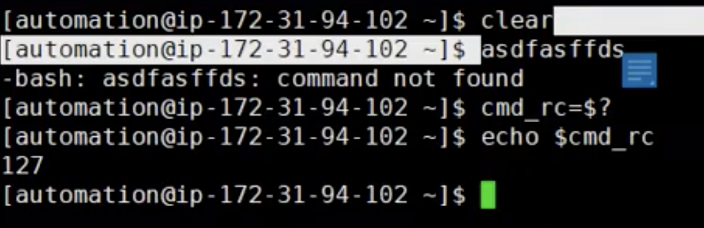
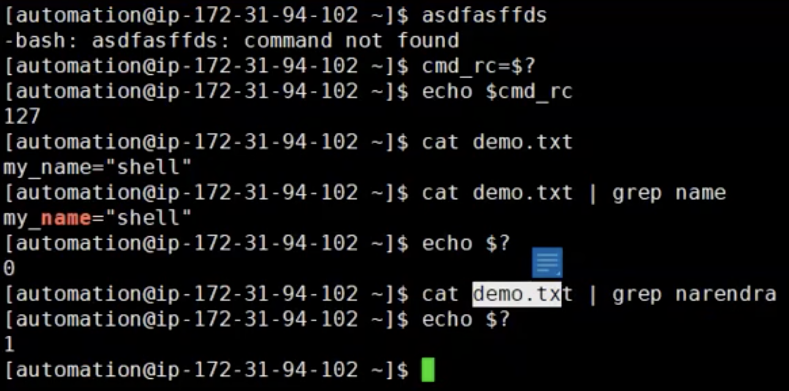

# Exit Status of a command
- Each Linux command returns a status when it is executed as a interger number
- We can check the exit status of the command with `echo $?`
    `x=$?` (storing exit status of a command into a variable)
A non-zero (1-255 values) exit status means command was failure
    - `127 - Command not found`
      
    - `1 - Command failed during execution. Example: Command is valid but during execution you got an error`
      
    - `2 - Incorrect command usage etc....can be an option or anything else`
      

- In the Example below we are assigning error status to variable
  
- Another Examples for exit status is:
  

Command exit Status is very useful in Scripting