# Basic Operations on Strings
- How we can define a string variable
    ```
    x="shell"  /   y="Shell scripting"  /   cmdOut=$(date)
    ```
    - Generally you do not need to assign double quotations for your variable but it is a good practice to assing it because it is used for spaces or special characters
    <br> 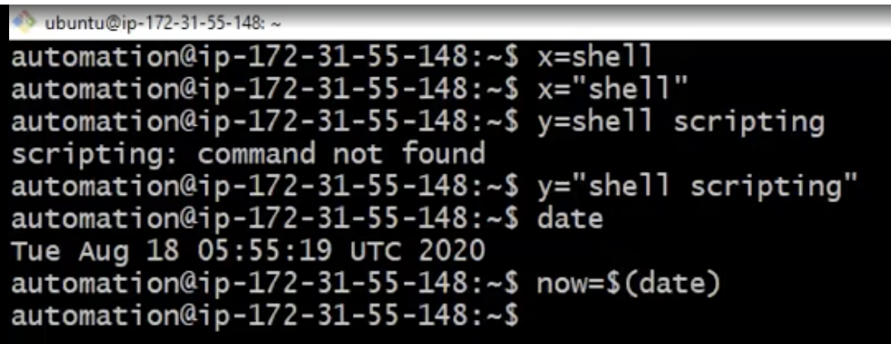
- How we can display the string variable values
    
    ```
    echo $x     or echo ${x}
    ```
    <br> 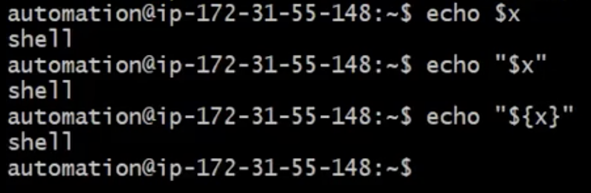

- How to find the length of a string. How many characters it has
    ```
    xLength=${#x}
    ```
    <br> 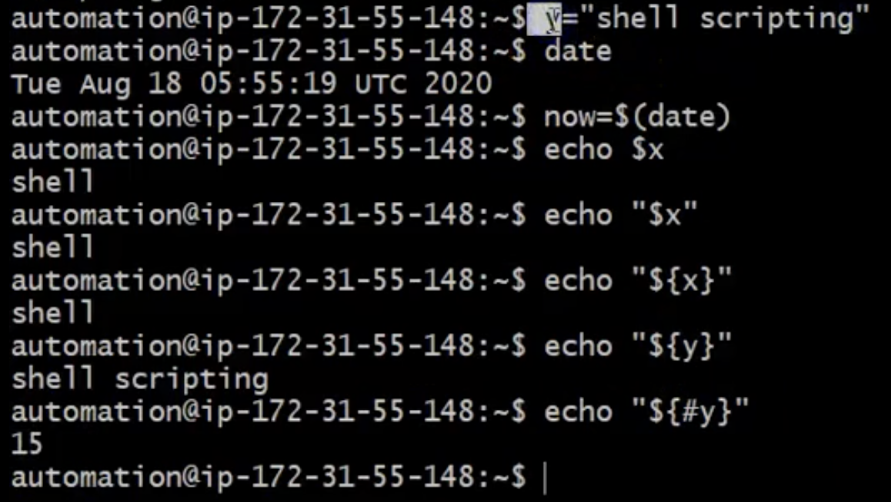
- Concatination of strings
    ```
    xyResult=$x$y
    ```
    <br> 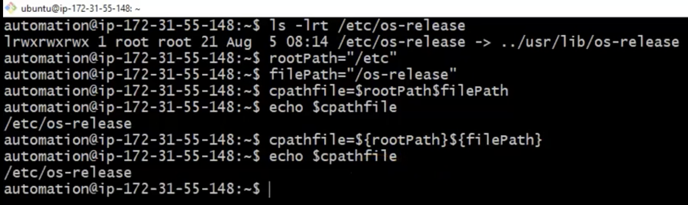
- Convert Strings into lower/upper case
    ```
    for upper ====>  xU=${x^^}   for lower  ===> yL=${y,,}
    ```
    - You can define vars this way or you can use commands to achive this statement like in the example
    - Upper example
    <br> 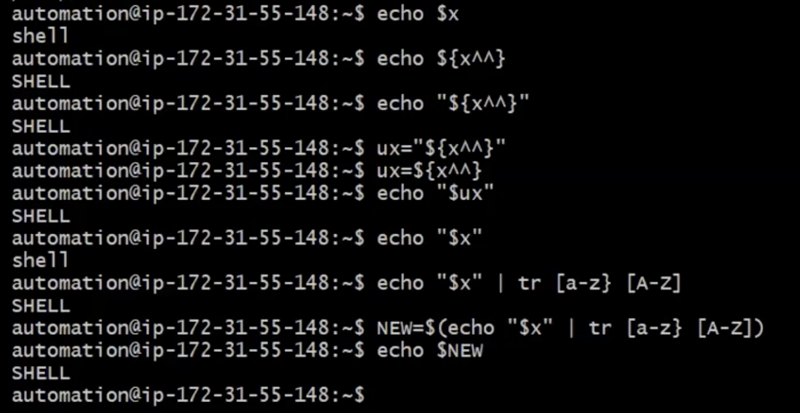
    - Lower example:
    <br> 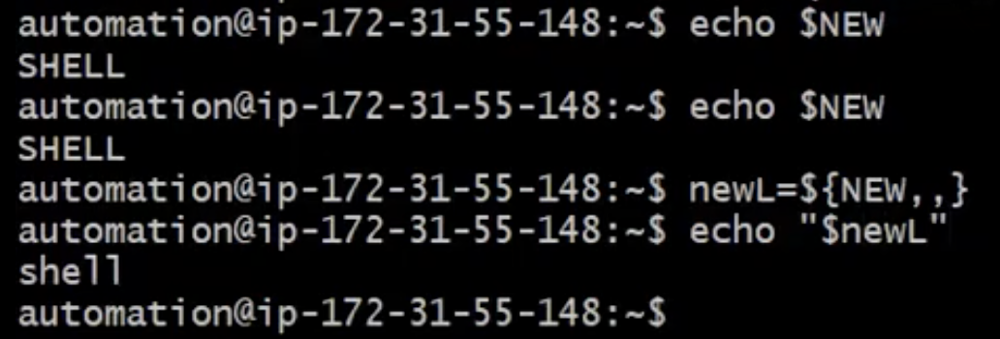
- Replacing the part of the string using variable
    ```
    newY=${y/Shell/Bash Shell}  or we can also use sed command
    ```
    <br> 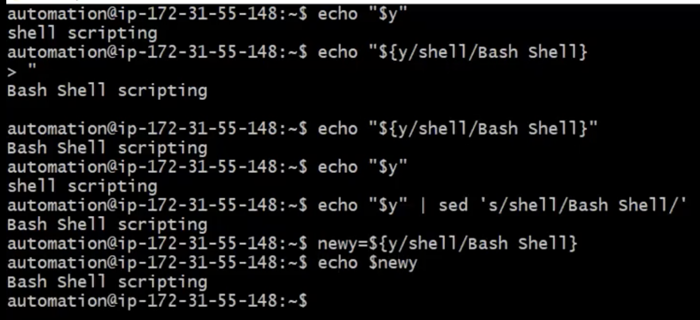
- Slicing the string/sub-string
    ```
    ${variable_name:start_position:length}
    ```
    <br> 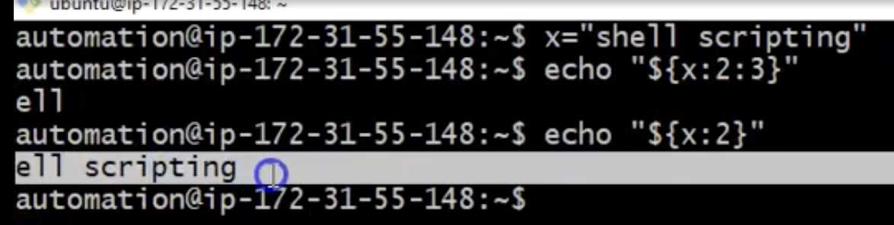

# String Operations on Path | Useful for Real-time
1. <b> `realpath` </b>  ======> Converts each filename argument to an absolute pathname but it does not validate the path
<br> 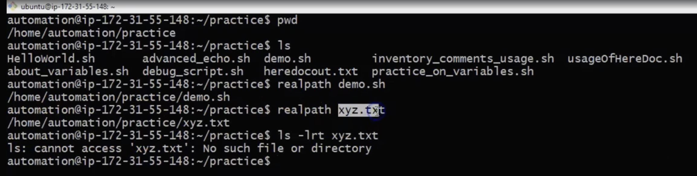

2. <b>`basename` </b>   ======> Performs many types of operations but first
        <br> 1. Strips directory information
        <br> 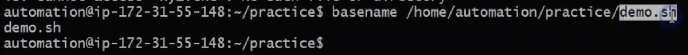
        <br> 2. Strips suffixs from file
        <br> 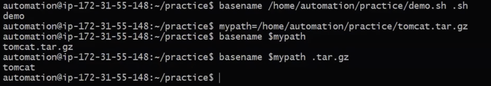

3. <b>`dirname`</b> =====> It will delete any suffix beginning with the last slash character and return the result
    <br> 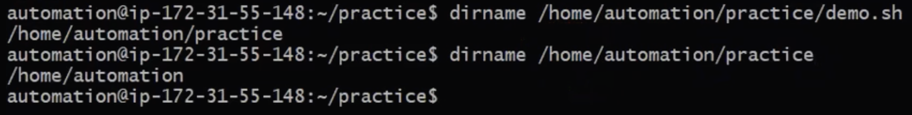