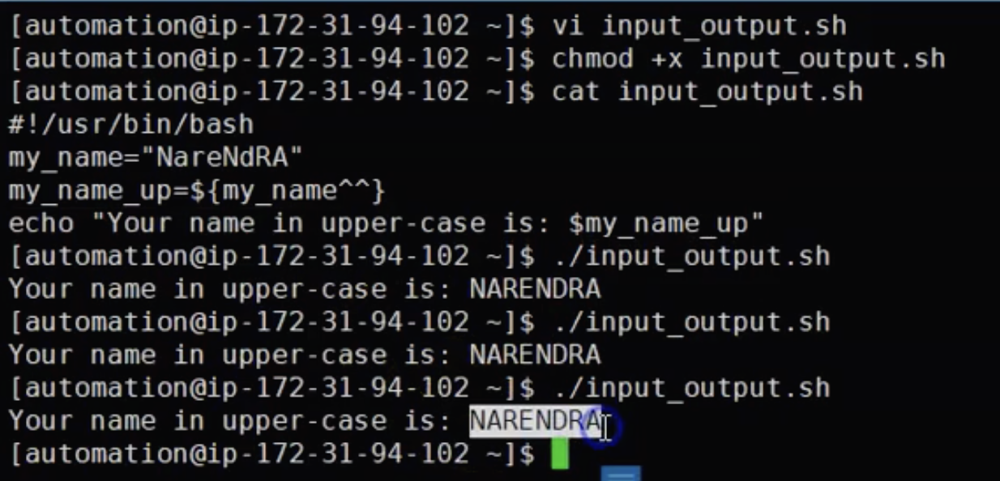
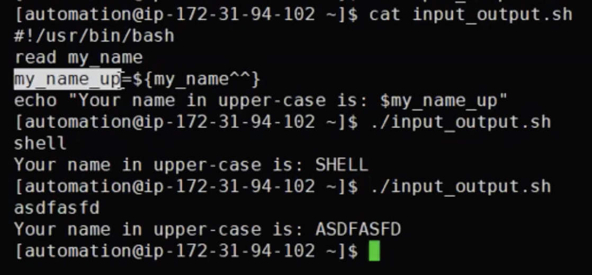
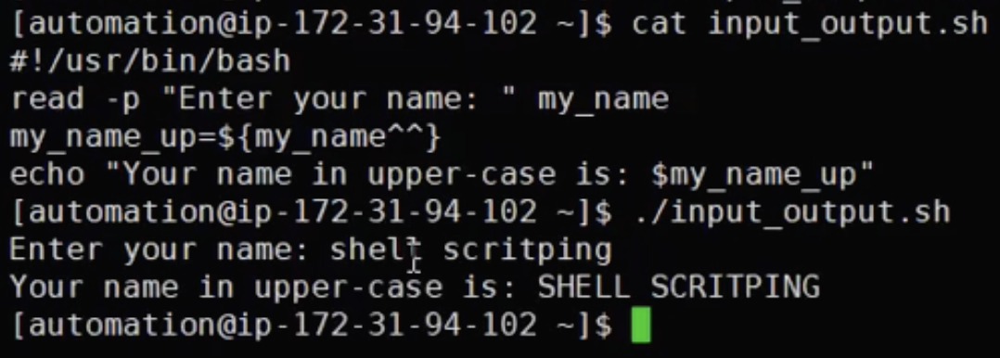
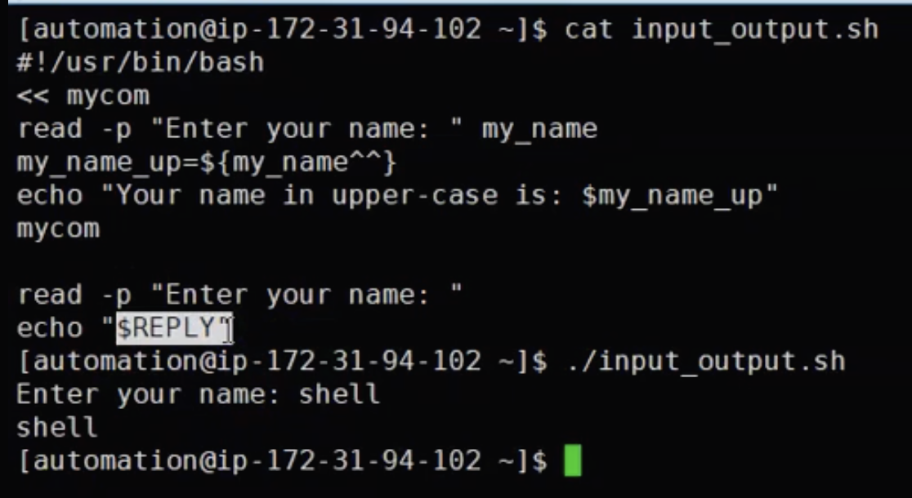
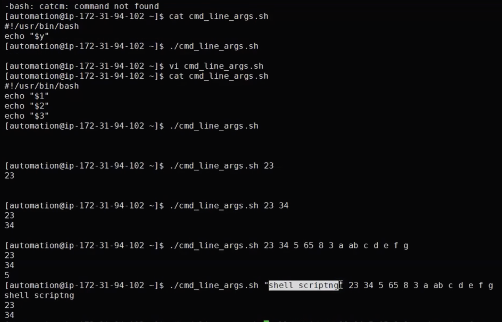
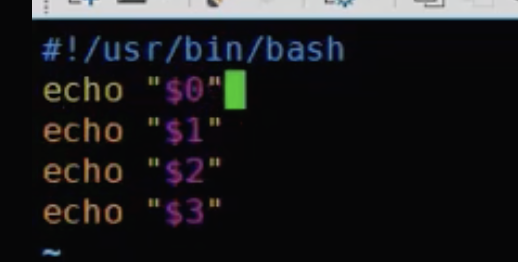
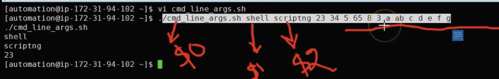
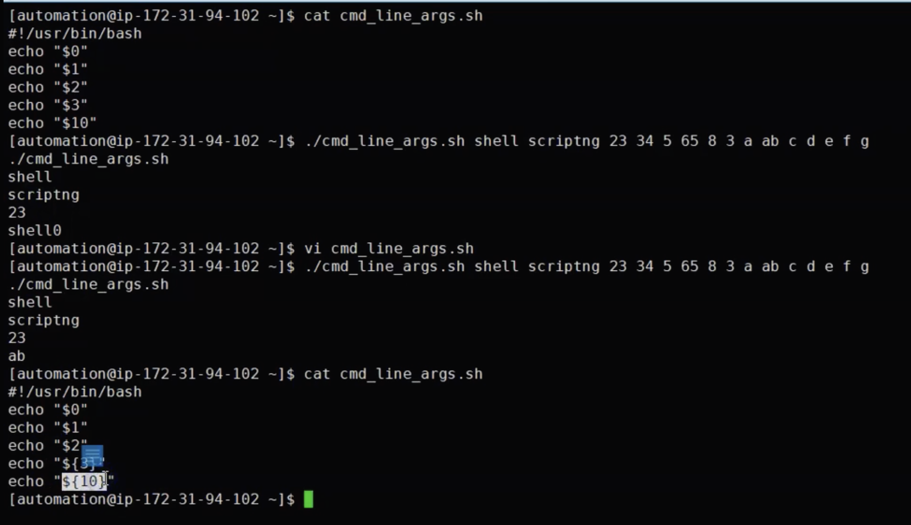
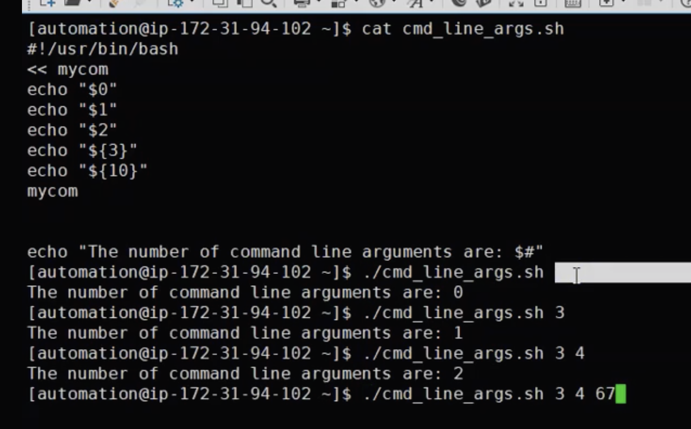
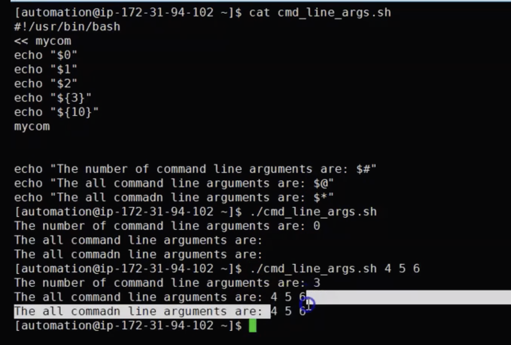

# `read` and `echo` command
- How to convert your variables to upper case, but this is more for static variables
  

- How can we make variable dynamic? You can achive this statement with `read` command
  

- If you want to make your command line to enter some values you need to use `-p` option like in the example below 
  

- If you do not enter some variables after read -p it will use default vars named `REPLAY` and it will assign it to it
  

# Input with command line arguments
- Insdead of `read` command you can also use command line argument or postional arguments to provide some values to your var file
- Command line arguments are the arguments/values specified at the command prompt running commands/shell scripts
- In bash scripting we have special variables that starts with $1 $3 $4 etc. Like in the exaple below
  

- Let see the usecase of `$0` in the example below.
- In this case `$0` will return script name itself
  

- As you can see it is referring to script itself
  
NOTE: This is called also postional agruments

- For two digit default vars you need to take curly braces in order not to opologies. Like in the example below use `{}` for tow digit numbers or at all to can define your default vars in `{}` like in the example below:
- For example in the below example we have variable 10 and we need to wrap it to curly braces.
- Even for your single digit command line argument you can take curly braces but it is not required 
  

- Use case of `$#` means to define the number of command line arguments
  

- Use case for `$*` or `$@` means everything it will pass
  
