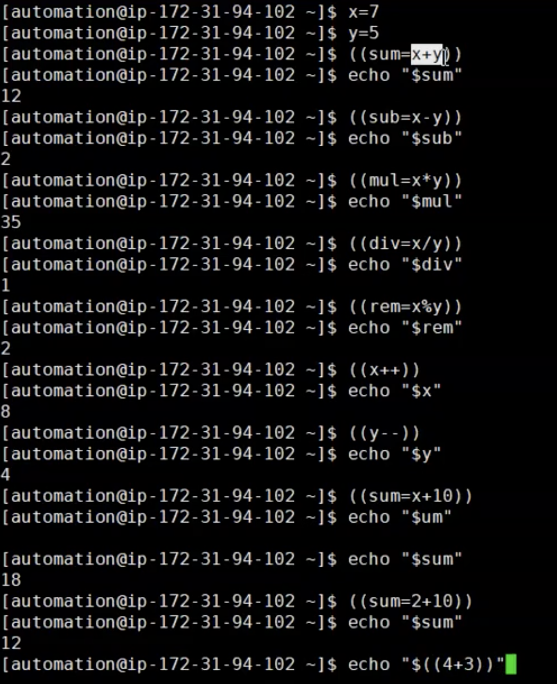

# Arithmetic Operators
- Shell script variables are by default treated as a string, not numbers, which adds some complexity to doing math in shell script 

- Even your number in your variable is integer or floating it will treat it as a string

- It is better to use Python or Perl with advanced level of mathimathical calucaltions but if you need to perform it in bash then you have more like a basic operations

- There are different ways to perform arithmetic operations: These commands are more like and old way to declare arithmetic operations 
    1. Using `declare`
    2. Using `expr`
    3. Using `let`
    - Some advanced commands to use in arithmetic operations are:
    4. Using `(())`  (For integers)
    5. Using `bc`  (For integer and float numbers)

Example: Using `(())`
- We have our variables defined as x and y 
- You can see the following operations in the image below
  