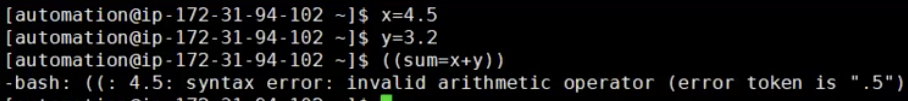
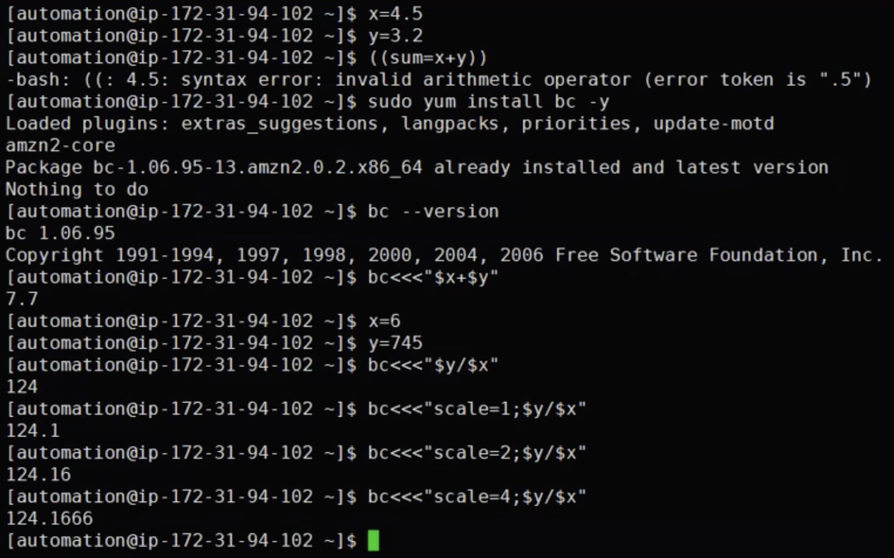
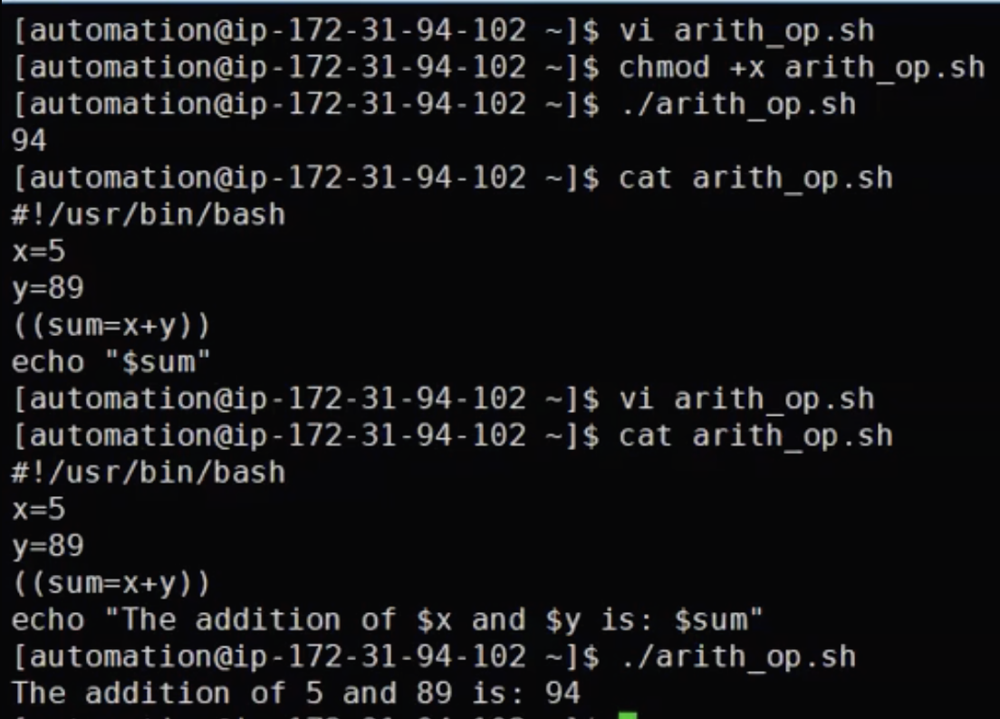
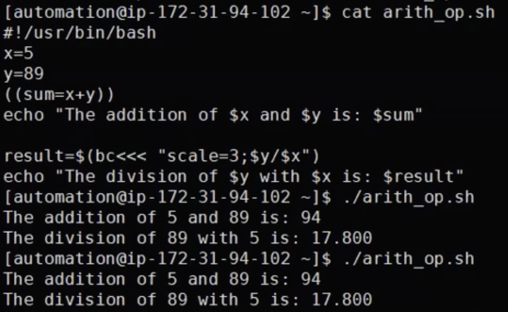
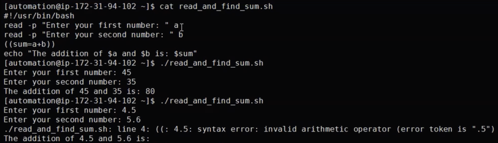
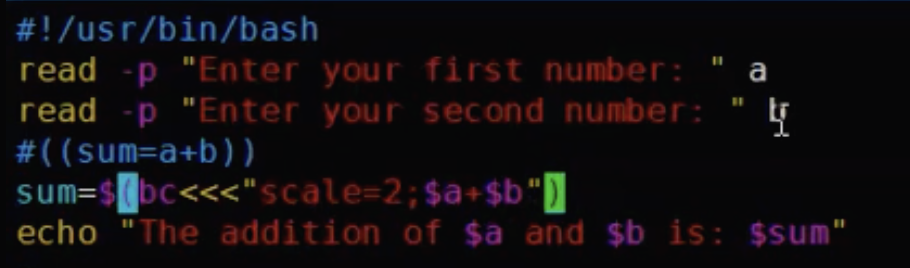

# Arithmetic Operators
- Shell script variables are by default treated as a string, not numbers, which adds some complexity to doing math in shell script 

- Even your number in your variable is integer or floating it will treat it as a string

- It is better to use Python or Perl with advanced level of mathimathical calucaltions but if you need to perform it in bash then you have more like a basic operations

- There are different ways to perform arithmetic operations: These commands are more like and old way to declare arithmetic operations 
    1. Using `declare`
    2. Using `expr`
    3. Using `let`
    - Some advanced commands to use in arithmetic operations are:
    4. Using `(())`  (For integers)
    5. Using `bc`  (For integer and float numbers)

Example: Using `(())`
- We have our variables defined as x and y 
- You can see the following operations in the image below
- `%` - means remider 
- `x++` means increment the value of `x`
- `x--` means decrement the value of `x`
- with `echo` command you can print directly your operations
<br> 

## Using `Floats` in arithmetic operations
- for `float` paranthesis `(())` are not applicable

<br> 

- For this reason we need to use Bash Calculator `bc` 
- NOTE: Some OS may not have Bash Calculator available or installed
```
sudo yum install bc -y
bc --version
```
- Examples: 
- Installation in case if you do not have bash calculator
- `scale` - means how many floating points you would like to get after `;`
<br> 

Example: Simple Shell script to define Arithmetic Operations
<br> 

- NOTE: For the division it is always better to use bash calculator
<br> 

- In case if you want to make your Arithmetic Operations more Dynamic with `read -p`
- NOTE: Question can be if `bc` can do pertty much everything why do we need `(())` paranthesis? Answer is they are good in combinaiton with loops
- The following script is good when you use it with integer numbers
- Examples: 
<br> 

- The following code is good when you have to use floats but in GENERAL STICK TO BASH CALCULATOR in your Arithmetic operations

<br> 
