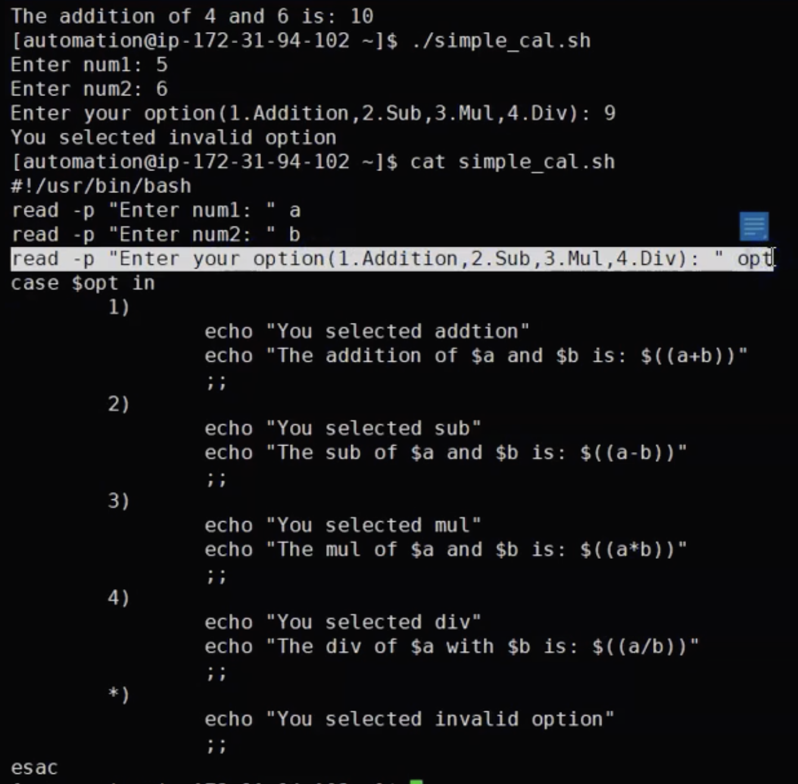
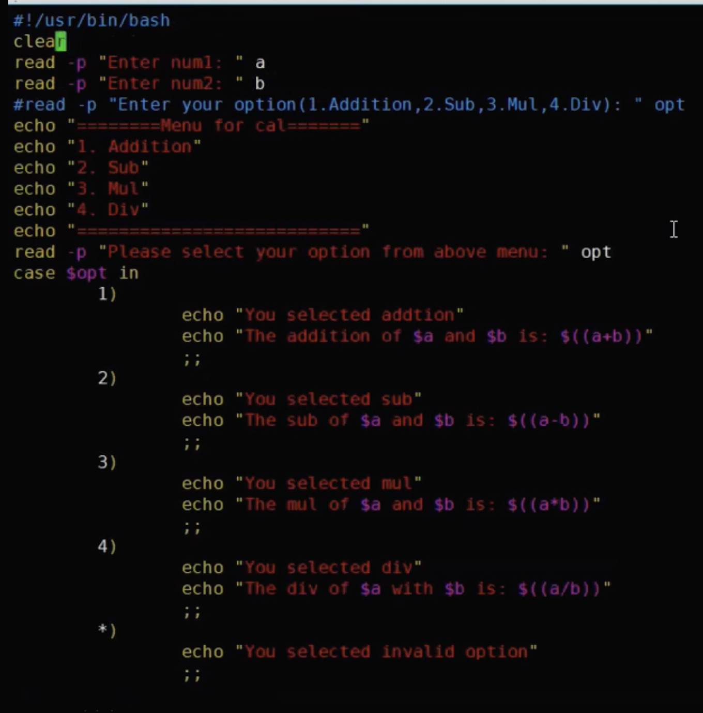

# Case Statement
```
Syntax
    - 
        case $opt in
              opt1)
                statement
                ;;
              opt2)
                statement
                ;;
              *)
                statement
                ;;
        esac
```
- You have statements like if first statement is matching then the next value will be executed, if no matches then it will proceed to next one

- `*` means all will be executed 
<br> 
- Another option for calculator
<br> 