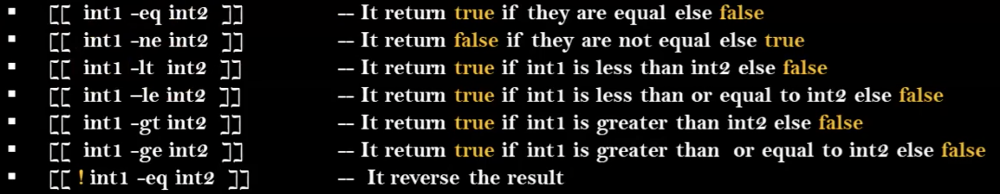
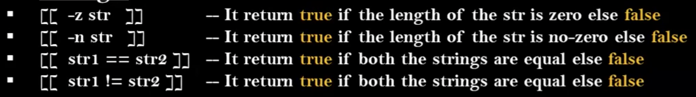
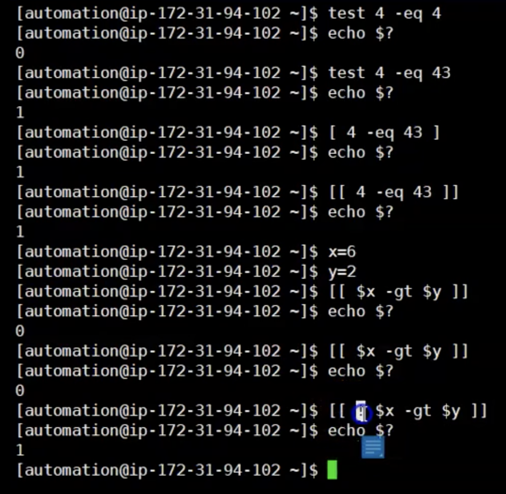
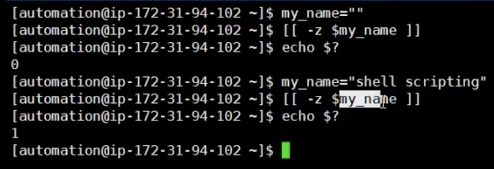

# test command

- It is a command used for conditionals
- Simple Syntax is: 
```
test condition or [ condition ] or [[ condition ]]
```
- NOTE: Difference between [  ] and [[  ]] is double square barces are more enhanced version to validate your condition
- NOTE: `[[  ]]` ===> works only with <b> `bash/ksh/zsh/ shells`</b>
- If you want to validate in other shells you can go with single braces `[]`

### How to make condition to work with `test` command? 
    - Comparison Operators
    - File Test Operators

## Comparison Operators with `test` command
- in Comparison operators we have two sets of section
    1. Numbers
    <br> 
    NOTE: `!` ===> means reverse condition
    2. Strings:
    <br> 

- Examples: 
    <br> 

    String example: 
    <br> 


