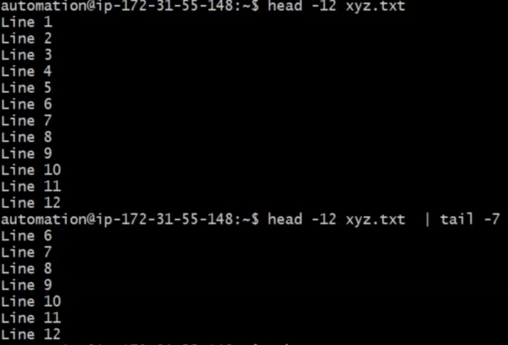
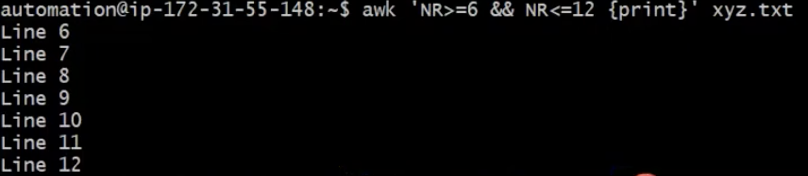
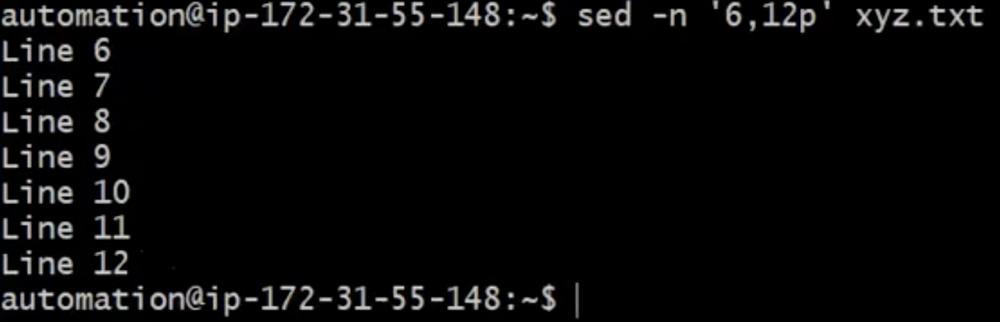

# How to Read/View/Display required range of lines from a given file? 
```
- Let say you want to Display from 6 to 12 line? How would you achieve that?
```
## You can Achive this with at least 3 different way
1. With `head` and `tail` combination
2. With `awk` command
3. With `sed` command

### Examples
- HEAD and TAIL command
```
Lets say you have 12 lines in your file and you want to display last 6 lines
```


- You can use AWK command as well but this is more requires you more writing


- You can also use SED command to display your lines and this is more useful way of displaying 


- PRACTICE
```
head -12 xyz.txt | tail -7
```
```
awk 'NR>=6 && NR<=12 {print}' fileName
```
```
sed -n '6,12p' fileName.txt
```