# GREP command usage
- `grep` command is a filter command, it is used to search a string in a given file
```
Example: Lets say you have txt file and you want to search for specific value like above or lines
```
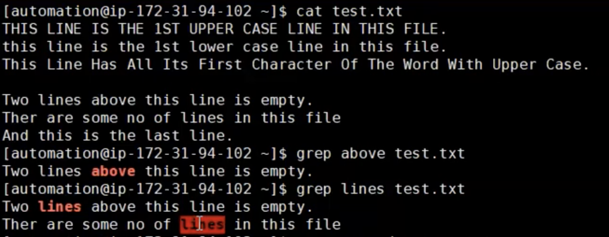
### NOTE: Always try to use '' for the string with grep. Look for the example
- Exmaple
<br> 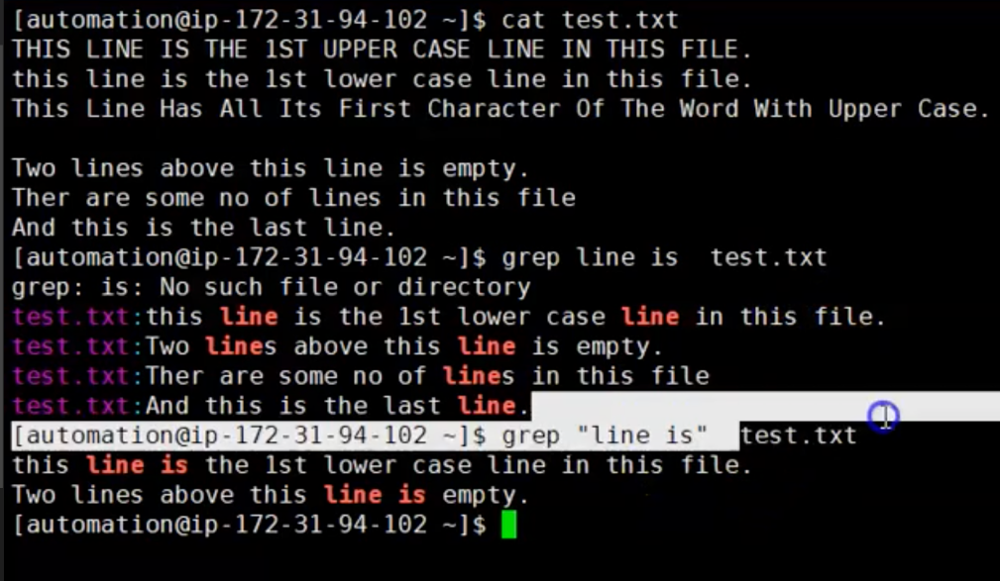
- You can search for a multiple files as well see the example below
<br> 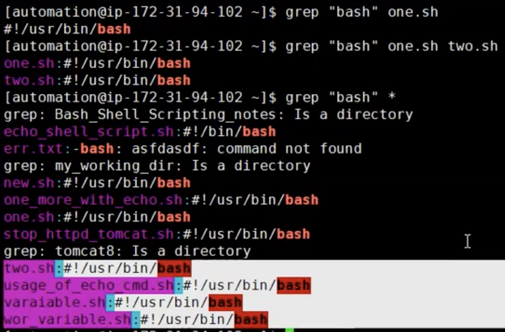

## Syntax of the `grep` command
<br> 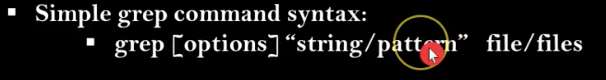

- You can use `pipe` for the grep command as well 
```
Example
```
<br> 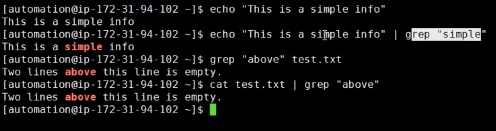

### This is the a syntax to use it with pipe
<br> 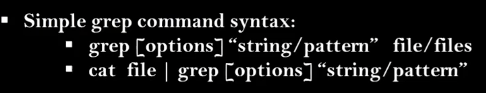

# `GREP` command basic options


- `-i` =====> To ignore case sensitivity
<br> 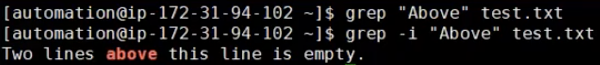

- `-w` =====> To match a whole word
<br> 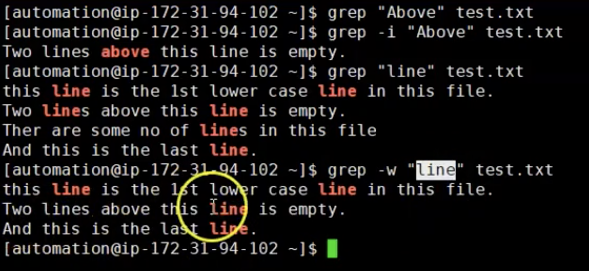

- `-v` ======> To display the lines that does not containe given string or text
<br> 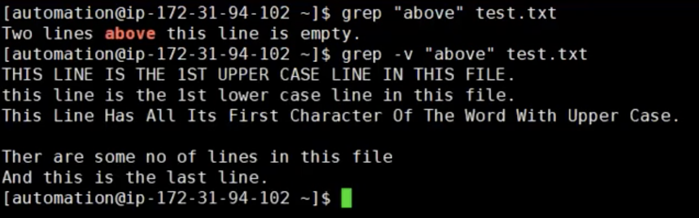

- `-o` ======> To print/display only matched parts from matched lines
<br> 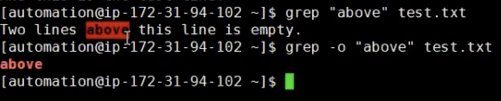

- `-n` ======> To display the matched line numbers
<br> 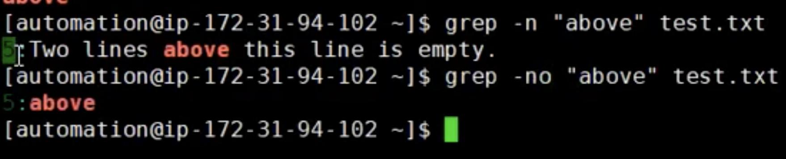

- `-c` ======> To display matched number of lines. In how many lines is the string
<br> 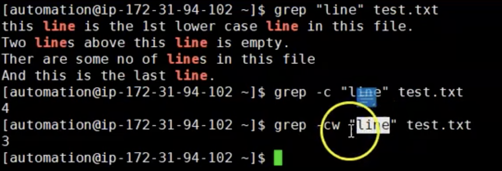

- `-A` ======> To display N lines after match (grep -A 3 "string" file)
<br> 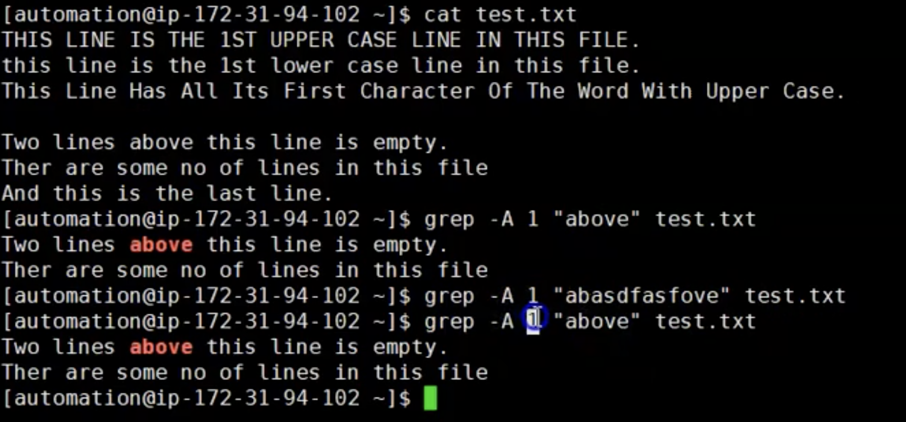
- `-B` ======> To display before the matcher or the string. We have space before the line there
<br> 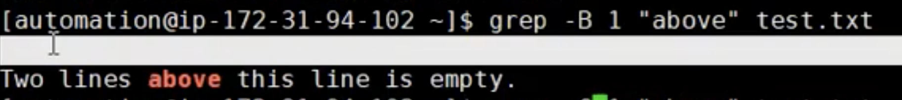
- `-C` ======> To print Before and After the matcher string. 
<br> 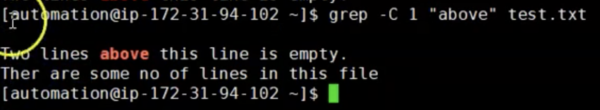

- `-r` ======> To look for a word in current directory and it is subdirectories
<br> 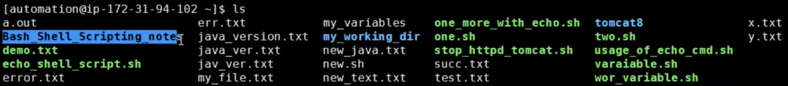
<br> 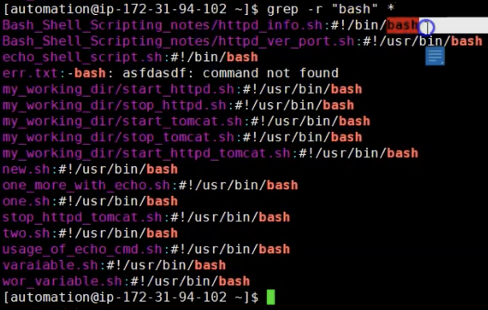

- `-l` ======> To display only file names. What file contains current string
<br> 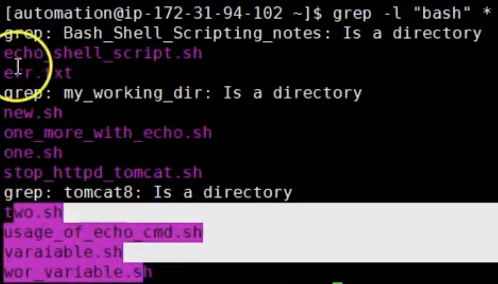
- `-h` ======> To hide file name 
<br> 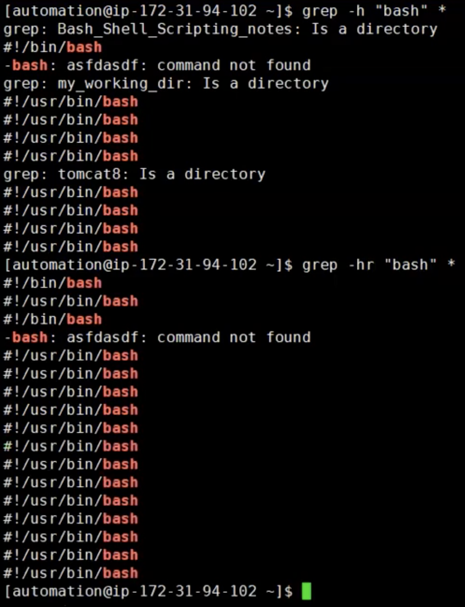

### NOTE: This are mostly used options and you can see more in `grep men`

# How to apply `GREP` command on the output of other command
<br> 
