# GREP command usage
- `grep` command is a filter command, it is used to search a string in a given file
```
Example: Lets say you have txt file and you want to search for specific value like above or lines
```
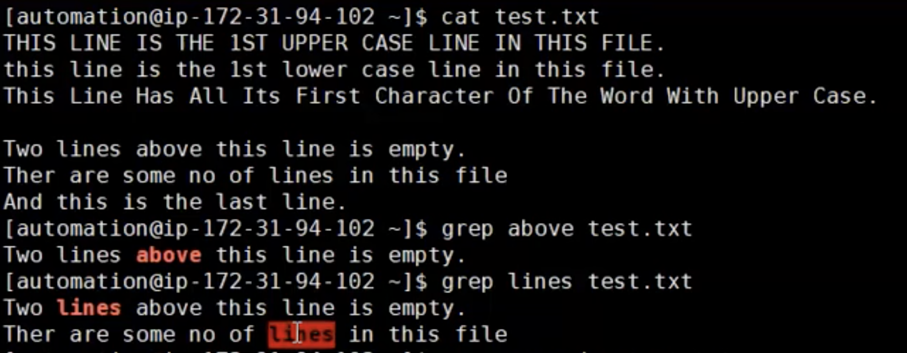
### NOTE: Always try to use '' for the string with grep. Look for the example
- Exmaple:
<br> 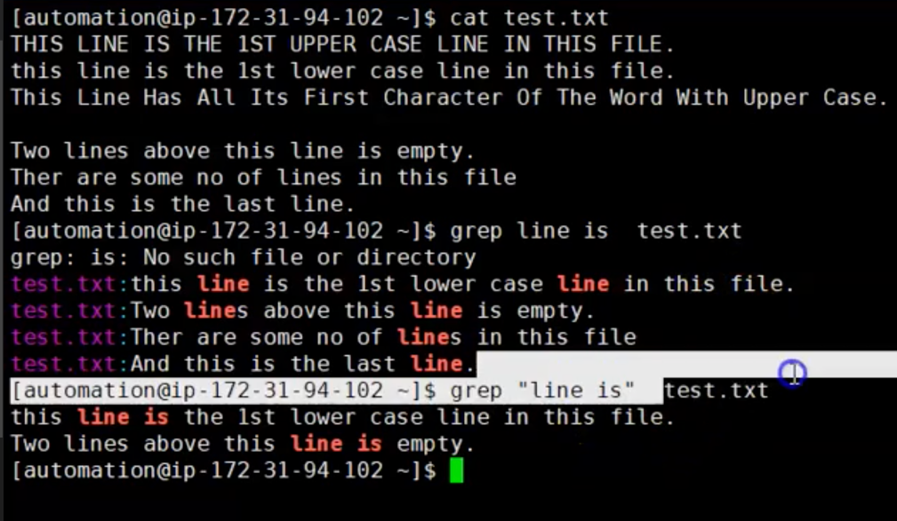

- You can search for a multiple files as well see the example below
<br> 

## Syntax of the `grep` command
<br> 

- You can use `pipe` for the grep command as well 
```
Example:
```
<br> 

### This is the a syntax to use it with pipe
<br> 

# `GREP` command basic options


- `-i` =====> To ignore case sensitivity

<br> 

- `-w` =====> To match a whole word

<br> 

- `-v` ======> To display the lines that does not containe given string or text

<br> 

- `-o` ======> To print/display only matched parts from matched lines

<br> 

- `-n` ======> To display the matched line numbers

<br> 

- `-c` ======> To display matched number of lines. In how many lines is the string

<br> 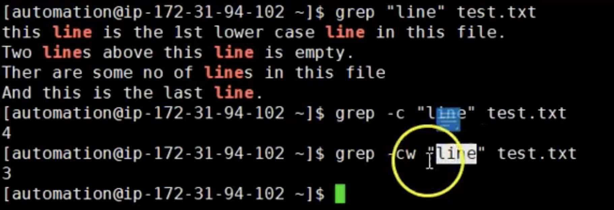

- `-A` ======> To display N lines after match (grep -A 3 "string" file)

<br> 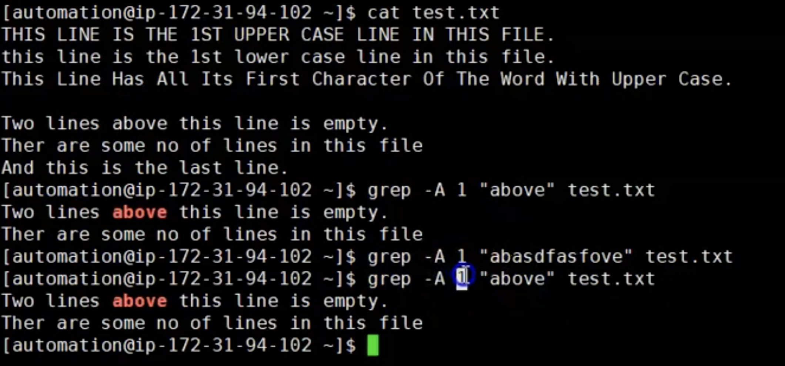

- `-B` ======> To display before the matcher or the string. We have space before the line there
<br> 

- `-C` ======> To print Before and After the matcher string

<br> 

- `-r` ======> To look for a word in current directory and it is subdirectories

<br> 
<br> 

- `-l` ======> To display only file names. What file contains current string

<br> 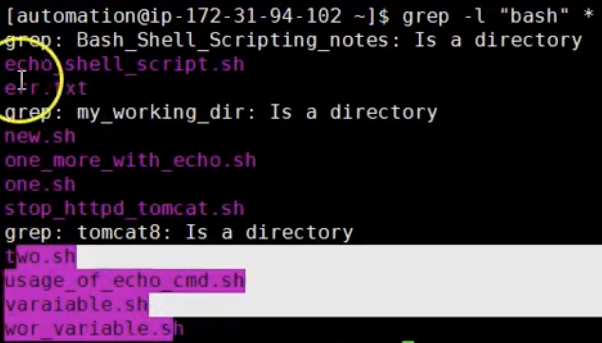

- `-h` ======> To hide file name 

<br> 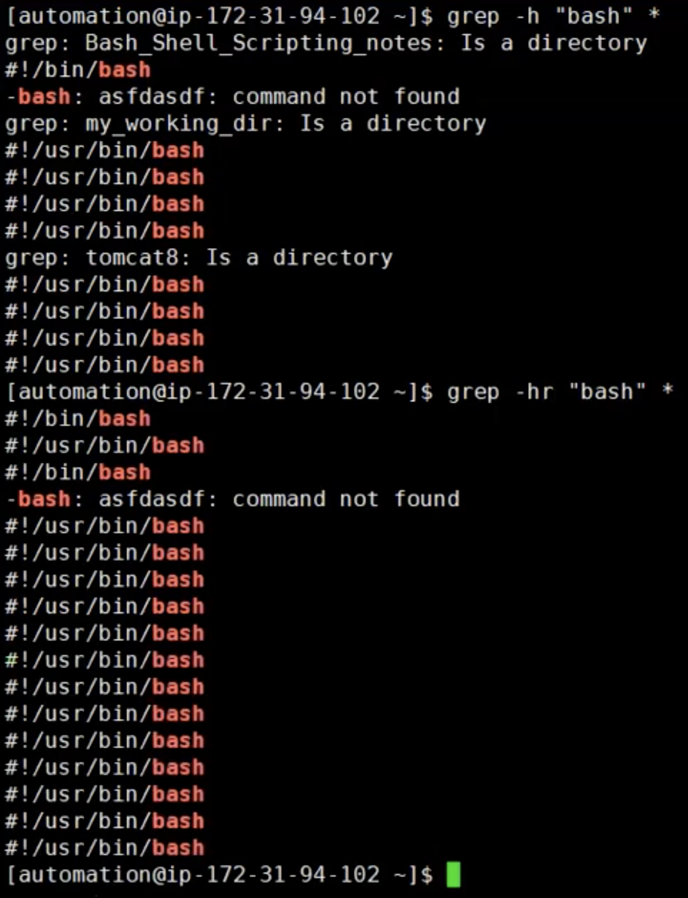

### NOTE: This are mostly used options and you can see more in `grep men`

# How to apply `GREP` command on the output of other command

<br> 


# `GREP` Advanced options
- `-f` ====> Takes search string/pattern from a file, one per line
<br> Lets say we have words in the file in the below image
<br> 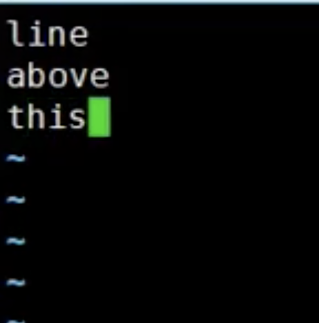
<br> And there is a matchers in the text file.txt this is kinda loops around the words. But words needs to be defined one per line
<br> 

- `-e` ====> To search multiple string/patterns
<br>

#### The most useful option for grep command

- `-E` ====> Works with patter. To run on the patter(more than one string). Mostly used one in the realtime
<br> 

#### Rules to create a patterns:
1. `xy|pq` ====> Matches for xy or pq
- We have example in the below pictures

2. `^xyz` =====> Matches for the lines which are starting with "xyz"
<br> 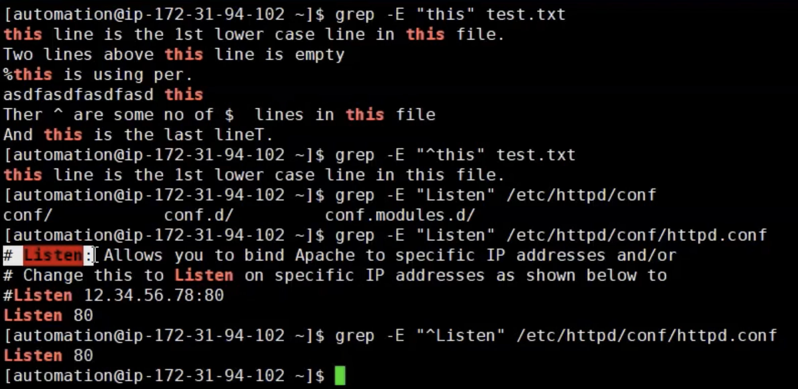

3. `xyz$` =====> Matches for the lines which are ending with "xyz"
<br> 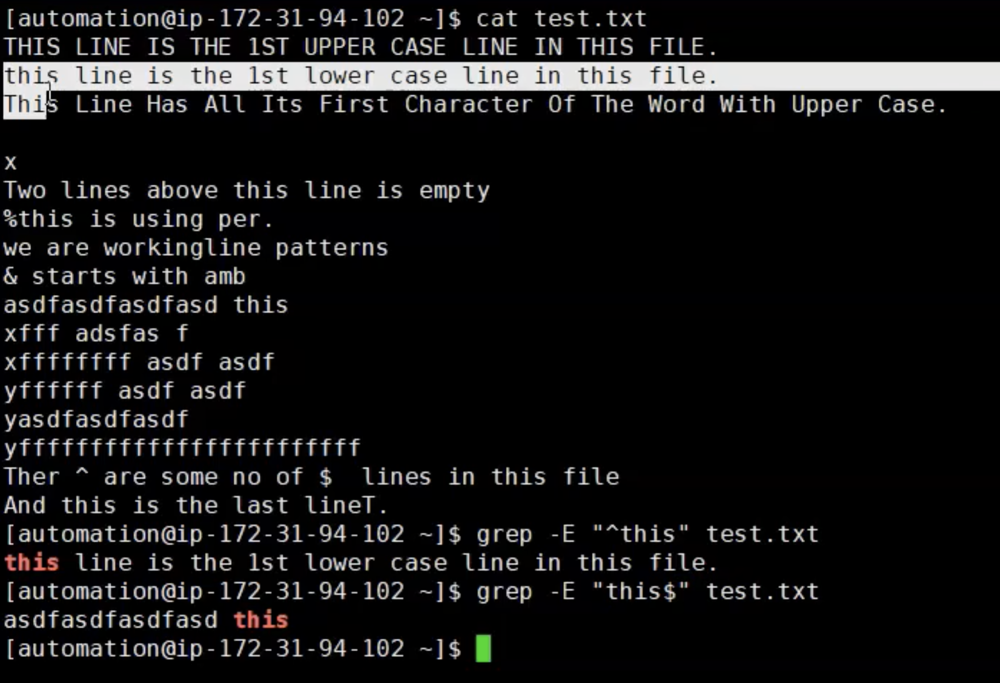

4. `^$` =====> Matches for the lines which are empty
<br> 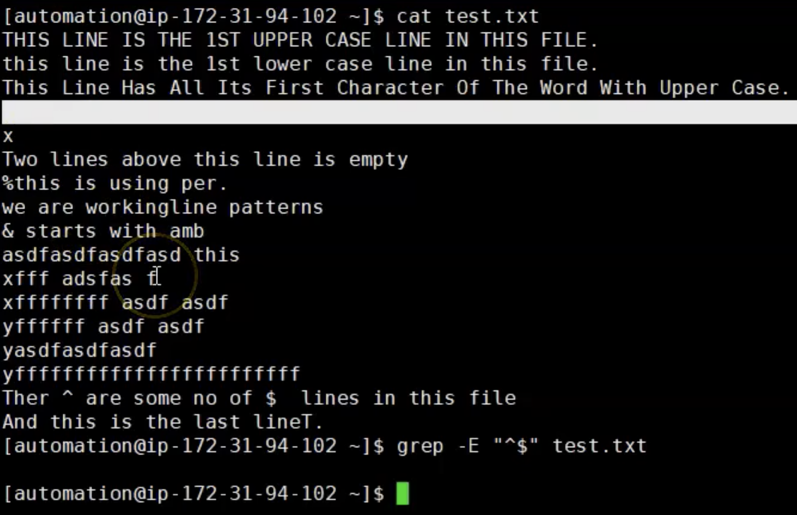

5. `\` =====>  To remove the special purpose of any symbol. Ex: \^ \$
<br> 
<br> 

6. `.` ======> Matches any one character
<br> 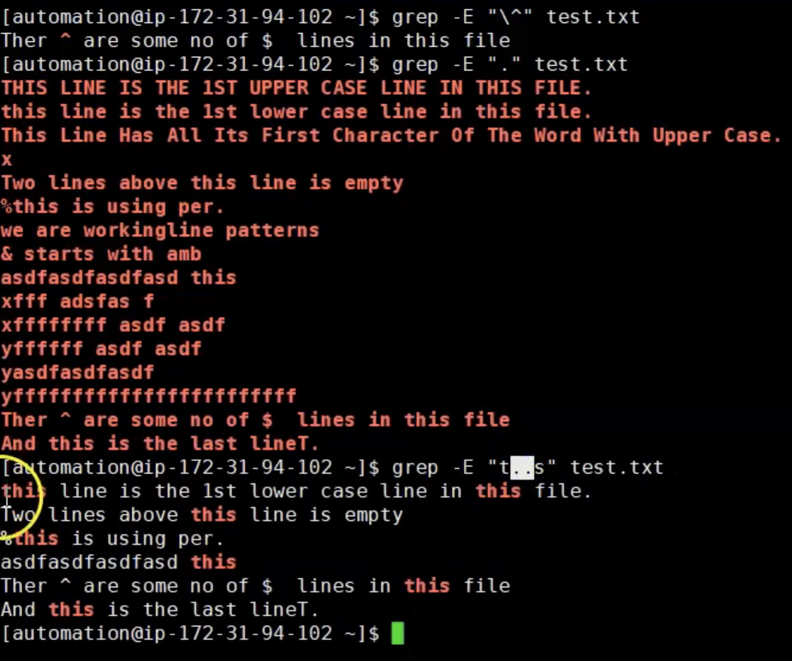

7. `\b` =====> Match the empty string at the edge of word
<br> 
<br> 

8. `?` =====>  The preceding character is optional and will be matched, at most, once
<br> 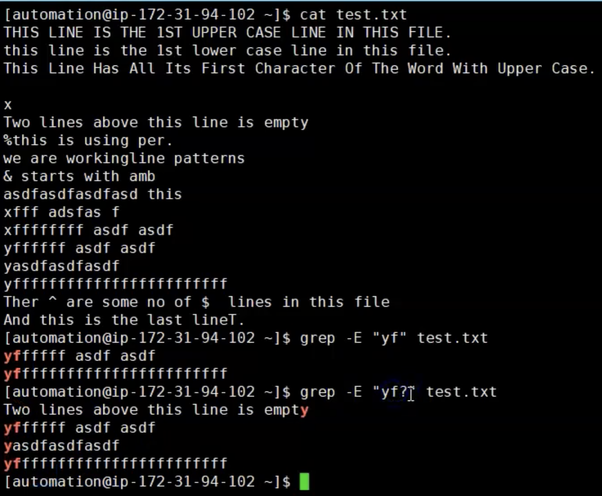

9. `*` =====> The preceeding character will be matched zero or more times
<br> 

10. `+` =====> The preceeding character will be matched one or more tiems
<br> 

11. `[xyz] ====> Matches for the lines which are having x or y or z
<br>  ===> is the same as in the above
<br> 

12. `[a-d]` is equal to `[abcd]` =====> Matched for the lines which are having a/b/c/d
<br> 

13. `[a-ds-z]` is equal to `[abcdstuvwxyz]`
<br> 

14. `^[abc]` =====> Matches for the lines which are starting with a/b/c 
<br> 
- the below example is, it will exclude thos symbols
<br> 

15. `{N}` ====> The preceeding string matched exactly N time
<br> 

16. `{N,M}` ====> The preceeding string matched at least N time but not more than M times

#### Other shortcuts

```
17. `[[:alnum:]]` - Alphanumeric characters
18. `[[:alpha:]]` - Alphabetic characters
19. `[[:blank:]]` - Blank characters: space and tab
20. `[[:digit:]]` - Digits: '0123456789'.
21. `[[:lower:]]` - Lower case letters
22. `[[:space:]]` - Space characters: tab, newline, vertical tab, form feed, carriage return, and space
23. `[[:upper:]]` - Upper-case letters
```
<br> 

# Practice
1. Write a patter only to match directories
```
ls -ltr | grep E '^d'
```
<br> 

2. Write a pattern to match only files
```
ls -ltr | grep -E '^-'
```
<br> 

3. Find the server ipv4 info from a file?
```
cat ipv4.txt | grep -Eo '[0-9]{1,3}\.[0-9]{1,3}\.[0-9]{1,3}\.[0-9]{1,3}'
```
<br> 

