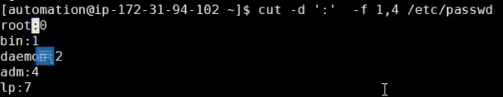

# `CUT` command

- The `cut` command is a powerful tool to extract parts of each line from a file
- `cut` - command is based on
    - Byte Position
    - Character Position
    - Field based on delimiter (by default delimeter is the tab)
    - Note: Byte and character are the same if you are using UTF8 1Byte=1Character
## Usage and exaples of the `cut` command

1. `cut -c` =====> will cut the firs character of the file
  
- Note: `cut -c` and `cut -b` are equal. c represents for character and b represents bytes

 - `cut -c 4,9 /etc/passwd` ====> will cut 4th and 9th caracter
  

 - `cut -c 4-9 /etc/passwd` ====> will cut from 4th up to 9th character
   

 - `cut -c -10 /etc/passwd` =====> will provide from 1st to 10th character
   

 - `cut -c 4- /etc/passwd` ======> will start from 4th to latest
   

2. `cut -f 2 fileName.txt` =====> will show second field of the file
- Let's say we have a file named example.txt and we want to get second filed seperated by delimeter(tab) spacing. Cut will work only with delimeter 
  
 - The following are examples for `cut -f` option
  

3. Let's say you put some spaces instead of tab in your file
  
 - If you want to use `cut -f` ===> it will not work because -f works with tab. As you can see in the example. It will print entire line.
   

4. Let's say you have a file where field seperater is ':' in cat /etc/passwd
   
 - `cut -d ':' -f 1 /etc/passwd` ====> where -d stands for delimeter(seperator), ':' stands for seperator and -f stands for a filed 1-is first field and file name 
   
 - Another examples is if you want to use display 1st and 4th fileds
   
 - Lets say you want to use different delimeter than ':' in the output
   
 - To cut from first line to 4th line
   
 - Lets say you want to put not column but '|' symbol instead
    
 - If you want to use default field seperator with tab then use this option `cut -sf 1 fileName.txt`
    
 - Lets say instead of default delimeter(tab) you want to display fields speperated by space in the example below and if you want to provide just space as delimeter 
     
 - `cut` ===> command examples. How you can apply both cut and grep command.
     

### Documentation for `CUT` command
  
  
  

