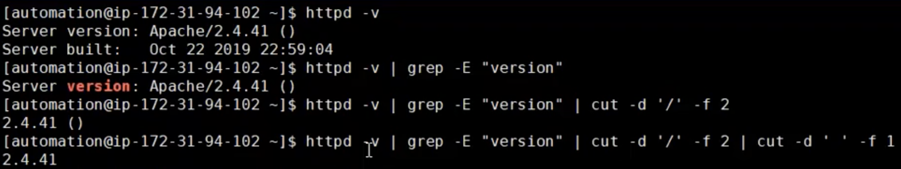
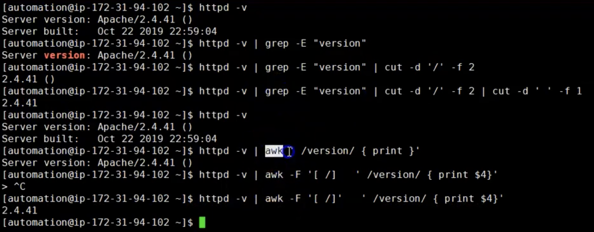
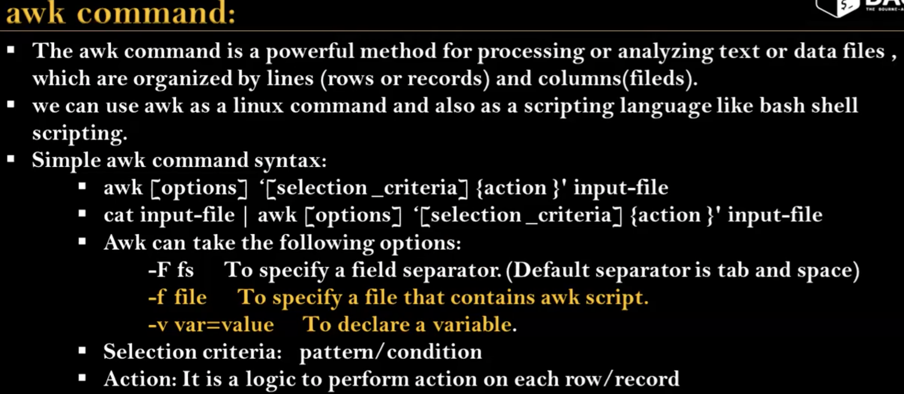
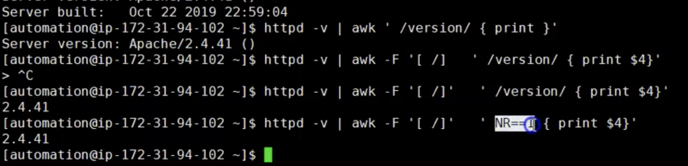
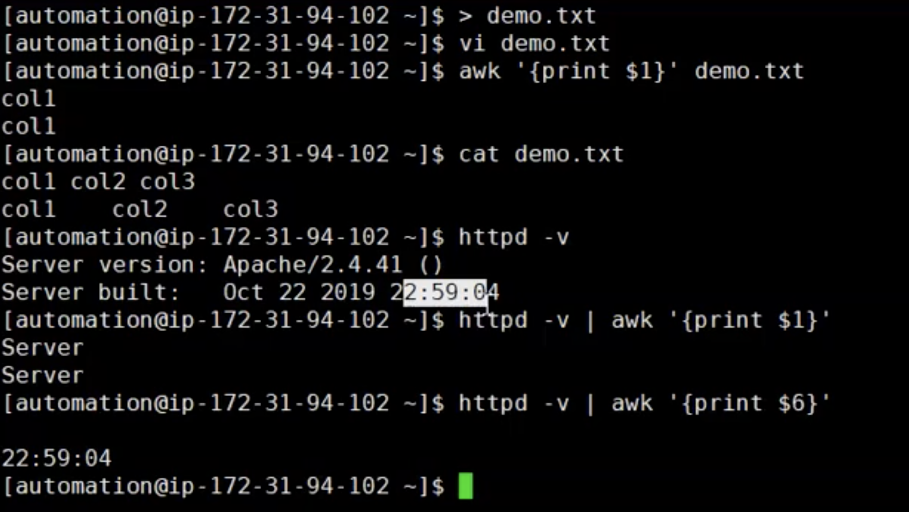
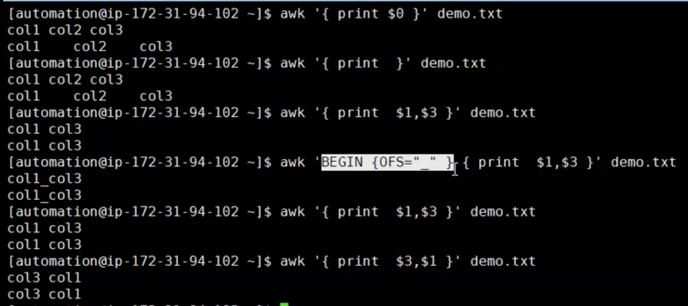
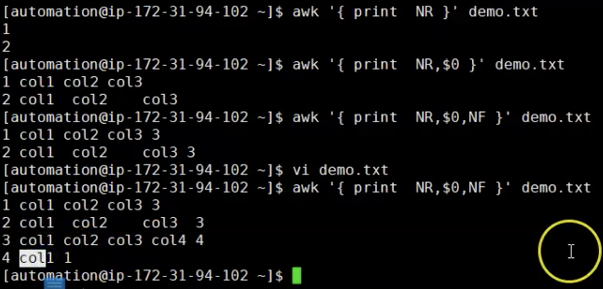
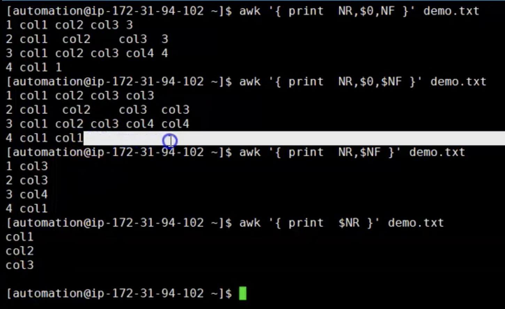

# `AWK` command usage
- You can use combination of grep and cut command to grep httpd version like in the picture or
  you can use awk command to get the same thing
  <br> 
- Or you can use `awk` command to get the same version like in the example. You can write at the same time number of patterns like there is -F and patter is space and / 
<br> 
NOTE: Difference between cut and aws is if you want to get characters use grep command and if you want to use fields only you can use awk command 

- The `awk` command is a powerful method for processing or analyzing text or data files, which are organized by `lines (row or records)` and `column (fields)` 
- We can use awk as a linux command and also as a scripting language like bash shell scripting.
- Examples:
<br> 
- Examples for awk command
<br> 

1. Simple `awk` command usage is:
```
awk 'action' input-file
```
- Example: 
<br> 

- This is simple `awk` command syntax:
  ```
  awk '{action}' input-file
  Action: Action is a logic to perform action on each record
  Example: print $1 print first field from each line
  Some of the default variables for awk:
    - $0 - Entire file
    - $1 - First filed from each line/record
  ```
  - Here are some examples for awk command: 
  <br> 

- `NR` ====> will print line or record number
    - NR $0 print all content with line number
    - NR line numner and NF means how many columns
  <br> 

- NF and NR examples of `awk` command
  <br> 