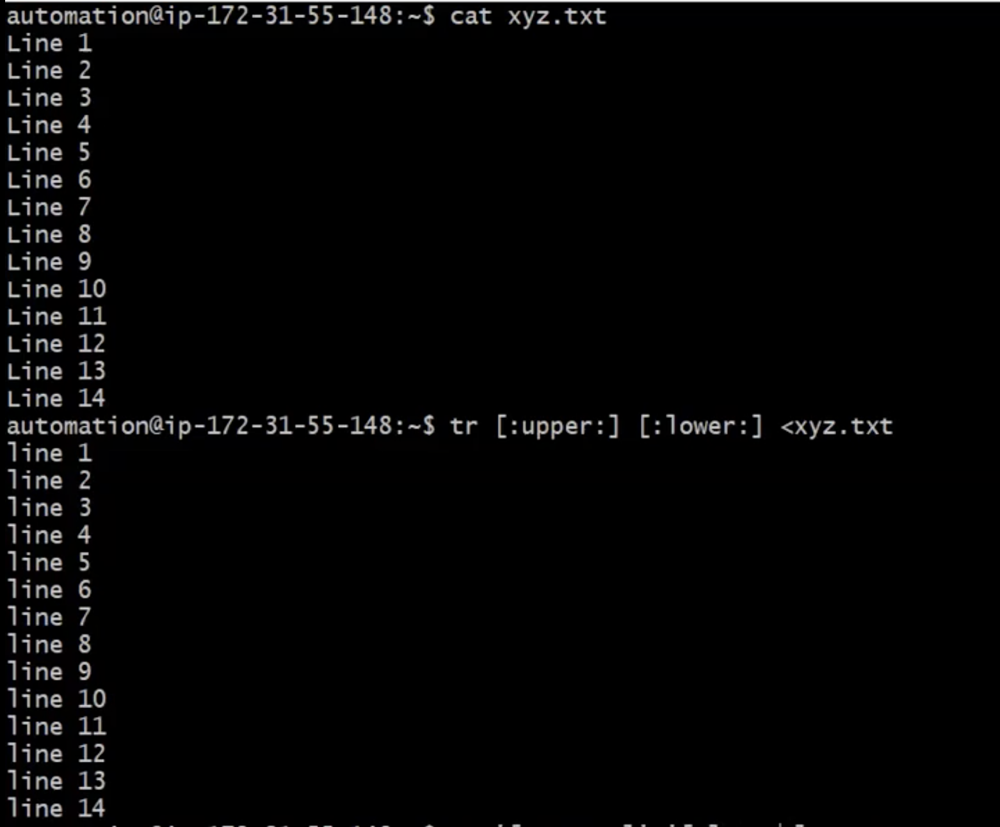
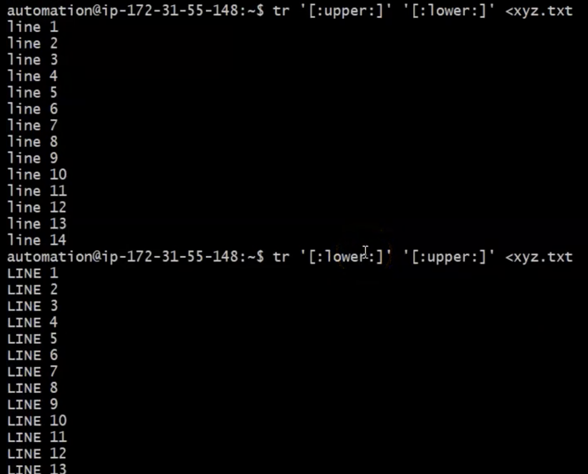
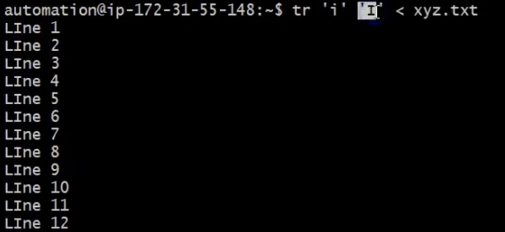
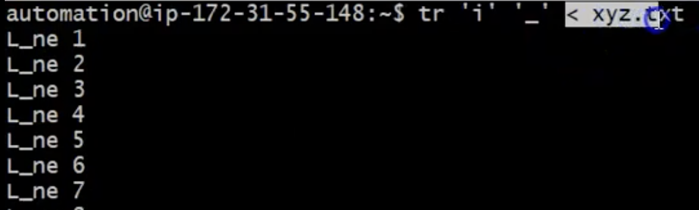
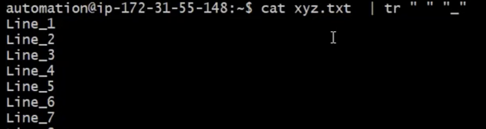
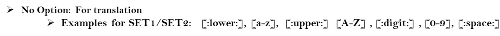
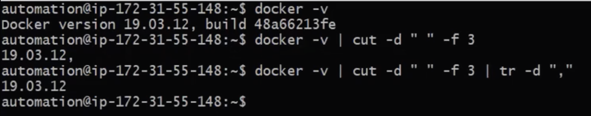

# `tr` command for shell scripting

- `tr`: short for translate
- `tr`: is useful to translate or delete given set of characters from the input. Input can be some file or some command output. 
```
Syntax:
    - tr [option] [SET1] [SET2] <inputFile
    - Some Command | tr [options] [SET1] [SET2]
```
- Example with no Option: Let's say you want to convert all upper cases to lower cases
  <br> 

- Another example of covnerting files: Note Better to use single or double quote like in the example 
  <br> 
- Lets replace all small 'i' to capital 'I'
  <br> 
  <br> 
- If you want to replace space to _ let say
  <br> 

- Some other default options are: 
  <br> 

- `d` ====> Deletes given set of characters
  <br> 
