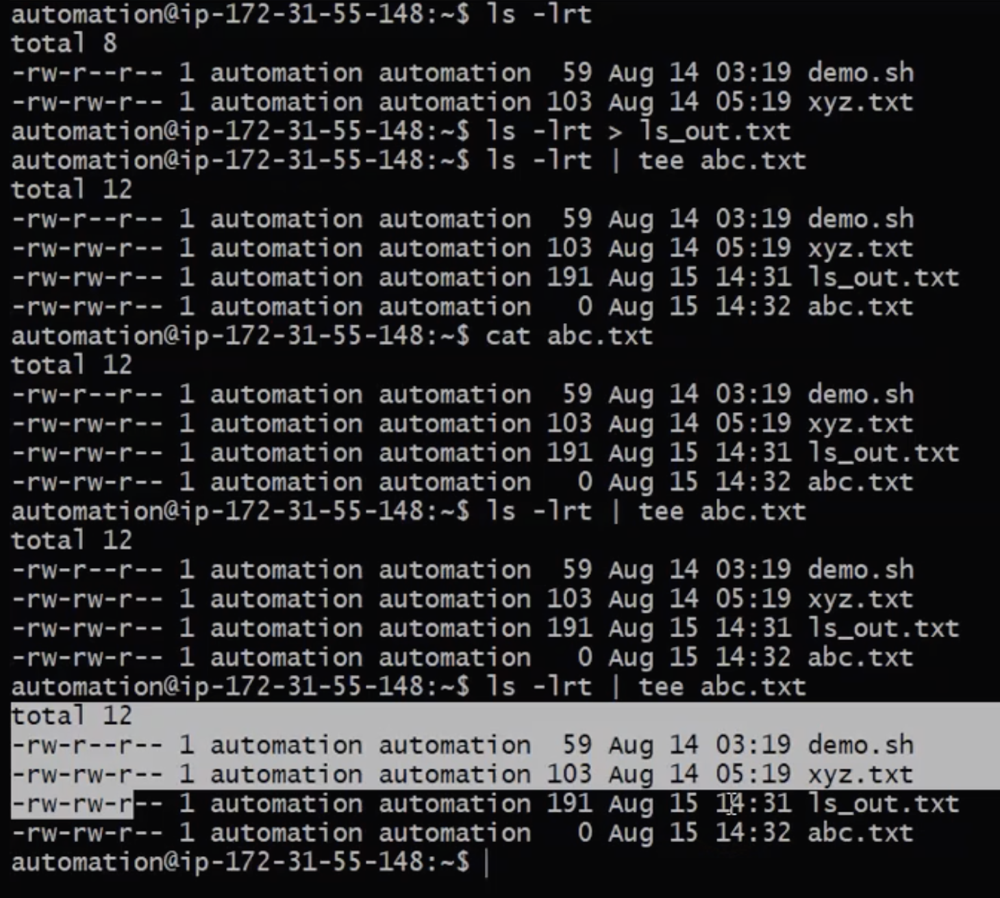
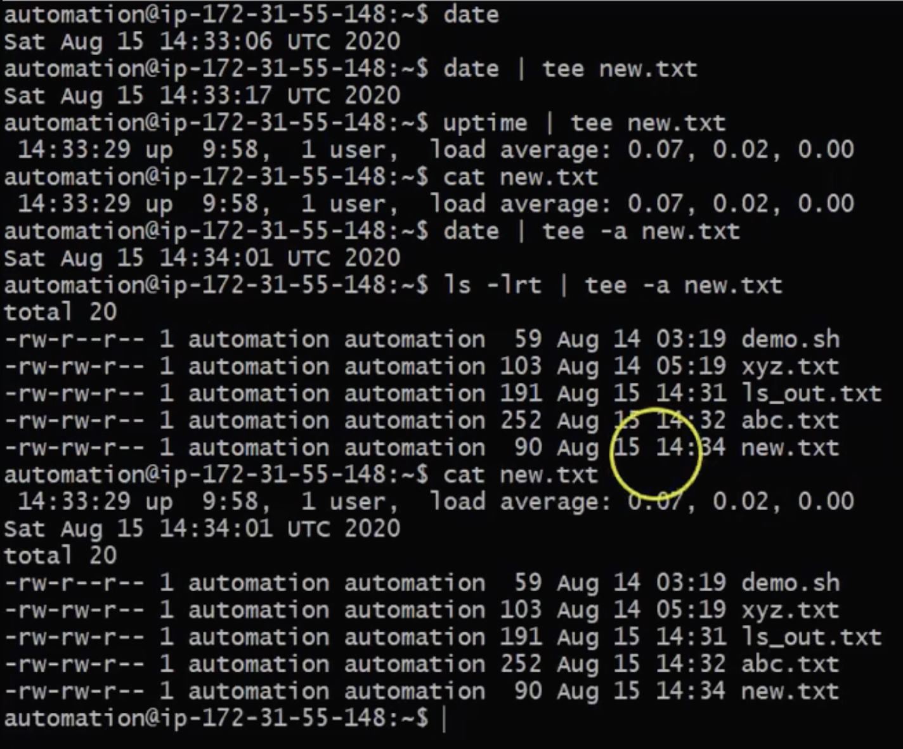

# `tee` - command

- `tee` ==> command is used to display the output and also to store that output into a file (It does both the task simultaneously)
- It is useful to create a log for shell scripting

```
Syntax: 
    command | tee outputFile.txt
```
- In the example below, it will not add but will display and write 
  <br> 

- If you want to continueoisly append output to file you have to use
```
command | tee -a outputText.txt
```
  <br> 
   