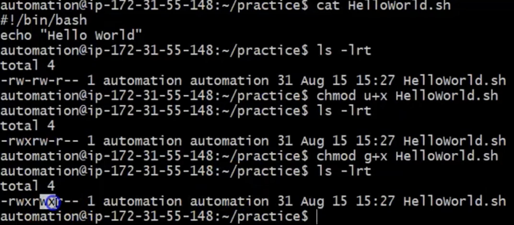

# First script usging `echo` command

- `echo` ====> command is used to display a string/message, variable value or command result

- Example: Simple `echo` command syntax to display a message:
- Syntax for `echo` command is:
```
echo string/message
echo 'string/message'
echo "string/message"
```
Example:
  <br> 

```
cat /etc/shells   ====> will show you what kind of shell script are you using
```
```
NOTE: Check the permissions before you deploy your code
```
  <br> 


# Advanced usage of `ECHO` command

## Basic usage of `echo` command
- Lets statr with basic usage of `echo` command
<br> 

- `echo` command is used to display string/message or variable value or command result

- Example for command result. Lets say you can run command seperately or with `echo` command as well
```
echo "$(whoami)" 
echo "The current logged in user is: $(whoami)
```
<br> 

## Advanced usage of `echo` command
<br> 

Display two lines ====> `-e` ===> `\n`
```
echo -e "This is first line\nThis is second line" 
This is first line
This is second line
```
Examples: 
<br> 

- `\` =====> Escape character examples

- Lets say you want to leave "" in the message then you can use `\` as in the example
```
echo "This is \"bash\" scripting"    ======> This is "bash" scripting
```
<br> 

- To displa messages in colors

- This are the color codes you can use with `echo` command
<br> 
NOTE: To reset the command line color use `\033[0m` like in the example
<br> 

- `echo -n "message/string/$variable/$(command)"` ===> if you want to append a line
<br> 
