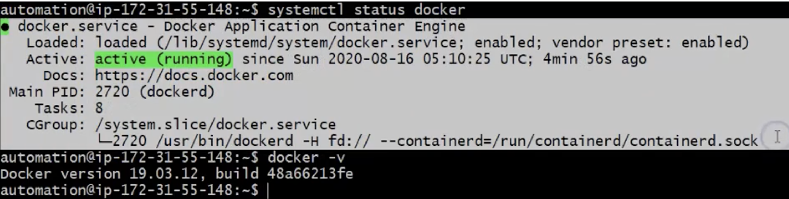

# Variables

- Variables are useful to store data in shell scripts so that Later we can use it if they required

```
simple varaibles are ====> x=4
- What ever we can define in the command line, we can apply the same things in the shell scripts
- 
```

- To display values of your varaible you can run
```
echo $VarName      or
echo "$x"   ===> string did not display value as you can see
```
  <br> 

- Default value of a variable is Empty/Nothing. 
- But there is env variables as well. Like in the example below

<br> 

##### There are two type of vars in Linux
1. System Variables:
    - Created and maintained by OS
    - This letters are always define with capital letters
    - We can see them by using `set` command
Example:
      <br> 
2. User Defined Variables
    - Created and maintained by the user 
    - This type of variables are defined in `lower letters`
    - We can also take combination of upper and lower case letters but try to avoid taking then solely with lower case

NOTE: if there is no env setup. It will print empty line

## Rules to create Vars
1. - Variable Name should contain only lower case (a-z) or uppercase(A-Z), 0-9 and _character. Avoid taking other characters then above
<br>Example:
    <br> 

2. Varaible Name length should be less than or equal to 20 characters
```
x=4 or Name=al
```

3. Variables Name are case sensitive. Means x and X are not the same
<br>Example:
      <br> 

4. Don't Provide space on either sides of equal symbol while defining varaible
<br>Example:
      <br> 

5. No need to declare varaible type, Automatically it will take care while executing commands or scripts
<br>Example:
      <br> 

6. Use quotes for the data if data consist of spaces
<br>Example:
      <br> 

7. We can store the output of a command into a variable as follows 
    - 1. anyValue=$(command)
    - 2. anyValue=`command`
<br>Example:
      <br> 

8. We can assign one variable value/data into another using:
    - Name="Shell Scripting"
    - NewName=$Name
    - NewName=${Name}
<br>Example:
      <br> 

# Simple Usage of Varaibles in Bash Script

- Taks is Pring Docker Status and Version

1. Before implementing Scripts you need to know commands to check the status and version of Docker

```
systemctl status docker
```
- Then we need to grap running from entire combination of strings
<br> 
```
systemctl status docker | awk '/Active/ { print $3 }' | tr -d "(" | tr -d ")"
or
systemctl status docker | awk '/Active/ { print $3 }' | tr -d "[()]"
```
<br> 
- To get a docker version you can extract it with the above command

```
docker -v | awk '/version/ {print $3 }' | tr -d ","
```
- Now we are going to writ Simple Bash script
```
#!/bin/bash
# Docker status
systemctl status docker | aws '/Active/ { print $3 }' | tr -d "[()]"
# Docker version
