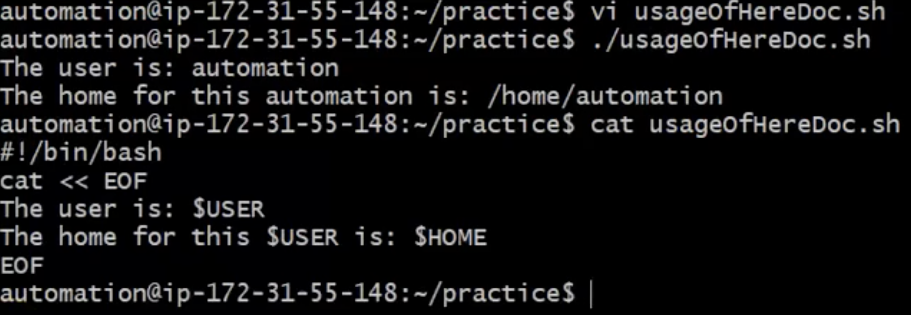
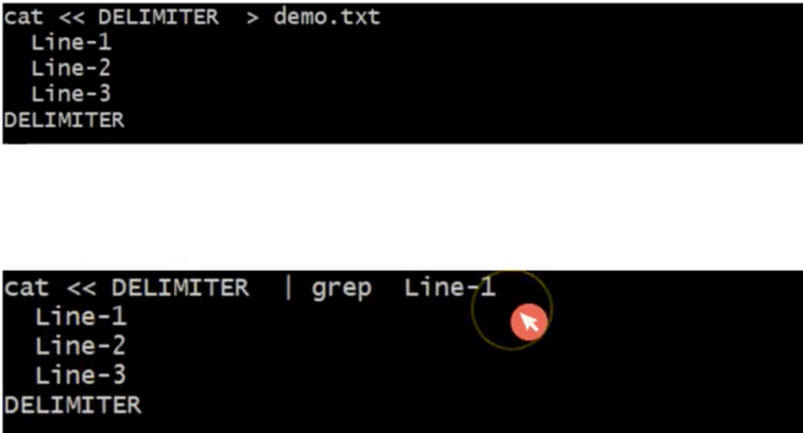
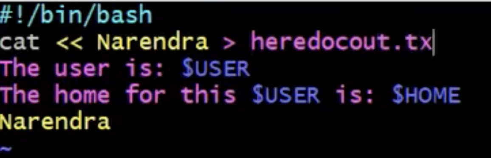
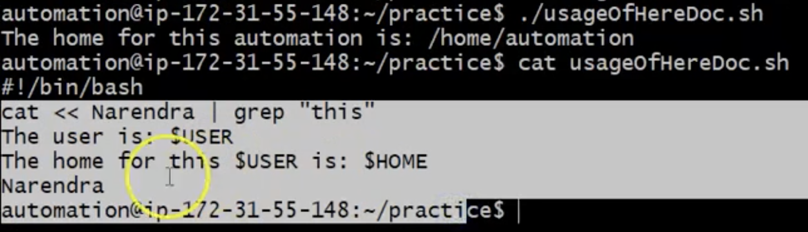
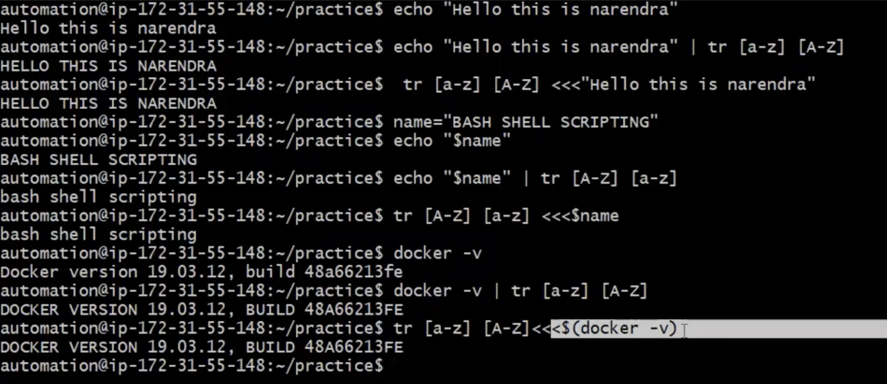

# Here document / Working with Multiline blocks
- Heredoc is very useful to write multi-lines or multiline block
```
command <<< Delimeter
Line -1
Line -2
Line -3
Anything you want to write
Delimeter
```
NOTE: Delimeter can be any string
- Heredoc is mostly used in combination with the combination of `cat` command
- Display multi-lines using `cat` command
<br> 

- We can also redirect this heredoc result into a file or as a input for another command
- <br> 
- <br> 
- <br> 

# Here String
- Here string is like a document but with one line
- Synax:
    ```
    command <<<string
    ```
- Some more Examples:
<br> 
